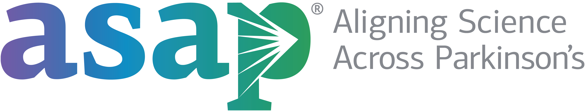
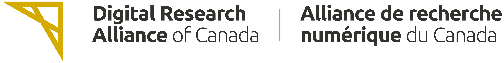
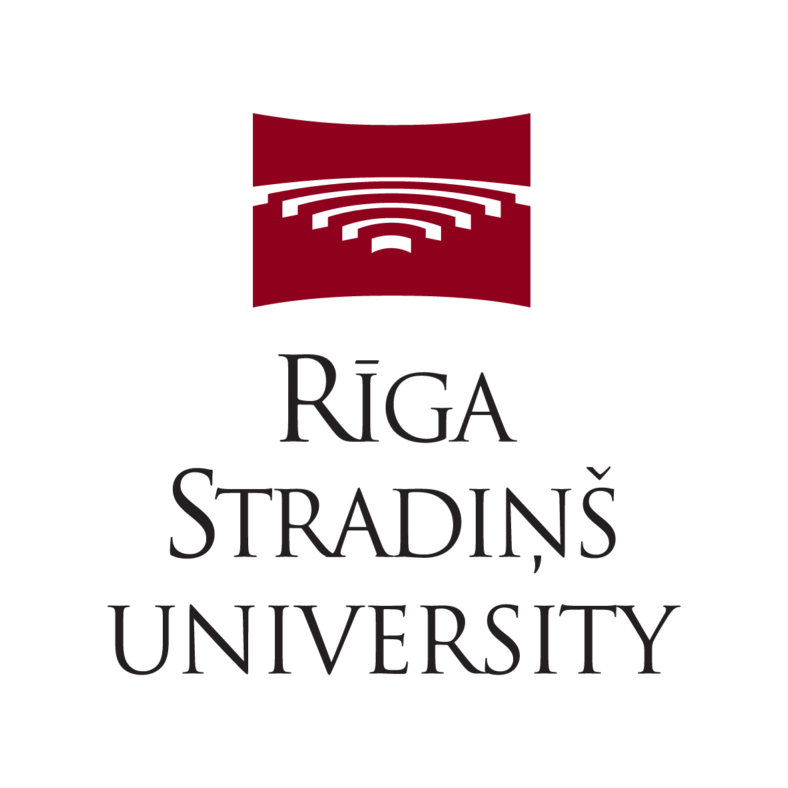

---
title:
date: 2025-04-23
type: landing

sections:
  - block: markdown
    content:
      title: 
      text:   |
        ReSA Organisational Membership
        {style="color: white; font-size: 2rem; text-align: center; "}
    design:
      background:
        image:
          filename: main-hero.png
          filters:
            brightness: 1
          parallax: false
          position: center
          size: cover
          text_color_light: false      

  - block: markdown
    content:
      title: Welcome to ReSA
      text:   |
        ReSA brings research software communities together to collaborate on the advancement of the research software ecosystem.
        **ReSA organisational membership** will demonstrate your commitment to international collaboration and innovation for research (including [AI-driven research](https://doi.org/10.5281/zenodo.13350748)) by supporting the ReSA vision that research software and those who develop and maintain it are recognised and valued as fundamental and vital to research worldwide.
        By joining us, you will have the opportunity to collaborate with decision makers and key influencers to create outcomes that will achieve both your goals and those of the international community. 

    design:
      background:
        color: "#ffffff"
        text_color_light: false     

  - block: markdown
    content:
      title: Organisational Membership Benefits 
      text:   |
        Opportunities to:
        - Collaborate with the international research software community to solve common issues
        - Further the international standing and influence of your organisation
        - Gain public recognition as an Organisational Member of ReSA and use of the official ReSA Organisational Member logo
        - Learn and share best practice 
        - Promote your work to a global audience 
        - Broaden your reach by collaborating on ReSA projects
        - Attend global community events
        - Access decision makers and key influencers 
        - Receive regular communications
        - ReSA Organisational Member Logo 
        

        

          
        

    design:
      background:
        color: "#edffeb"
        text_color_light: false  

  - block: markdown
    content:
      title: How to join 
      text:   |
        **To become a ReSA Organisational Member**, please provide your [contact details](https://airtable.com/shrI5UKJesqNoFiD7), and review the optional [membership agreement](https://docs.google.com/document/d/1arCDTzFaM8gavaSBOFcuHSI_m_WmvV4pJjwDVdNwmbk/edit) and consider if it is beneficial for you and if your organisation wishes to also sign this, or contact [memberships@researchsoft.org](mailto:memberships@researchsoft.org) to discuss further. Membership is for the calendar year. Organisations that join after 1 July are eligible for a 6-month membership. Membership fees are invoiced through our fiscal sponsor, [Code for Science and Society](https://codeforscience.org/). An [overview of Organisational Membership](https://docs.google.com/document/d/1Rlw55m1D4oQbwvwBzxUFvIVJYQ32QD5x/edit) (which summarises this webpage) is also available for use. Information on how ReSA funds are used is included in [About Us](https://www.researchsoft.org/about-resa/), and [donations](https://www.researchsoft.org/donate/) are always welcome.

    design:
      background:
        color: "#ffffff"
        text_color_light: false  

  - block: markdown
    content:
      title: Annual Investment
      text:   |
        | Number of employees | High Income Country - Not-For-Profit (USD$) | High Income Country - For-Profit (USD$) | Low/Middle Income Country - Not-For-Profit (USD$) | Low/Middle Income Country - For-Profit (USD$) |
        |--------------|-------------|-------------------|------------------|----------------|
        | less than 150  | $2,500        | $4,000   | $500  | $800     |
        | 151-250   | $5,000   | $8,000  | $1,000    | $1,600      |
        | 250 or more   | $12,500  | $20,000    | $2,500     | $4,000   |

    design:
      background:
        color: "#edffeb"
        text_color_light: false
        
  - block: markdown
    content:
      title: Recent ReSA Achievements
      text:   |
        - Leading the development of a [research software funders community](https://www.researchsoft.org/funders-forum/) that has engaged 60+ funding organisations in its goal to address common challenges to achieve the significant cultural change needed across the research sector and better coordinate investment globally. See [Amsterdam Declaration on Funding Research Software Sustainability](https://adore.software/declaration/).
        - Engaging in drafting of the [OECD Recommendation on Access to Research Data from Public Funding](https://www.oecd.org/sti/recommendation-access-to-research-data-from-public-funding.htm) and [UNESCO Recommendation on Open Science](https://en.unesco.org/science-sustainable-future/open-science/recommendation), which has led to the inclusion of research software in key international policy and [toolkits](https://www.unesco.org/en/open-science/toolkit-fostering-open-science-practices).
        - Facilitating global [community forums](https://www.researchsoft.org/community-forum/) and discussions, supported by [analysis](https://www.researchsoft.org/resa-resources/) of relevant issues, to identify community priorities and create task forces on topics such as [research software policy for research institutions](https://www.researchsoft.org/software-policies/), and [research software authorship](https://www.researchsoft.org/tf-authorship-contribution/).
        - Co-leading the drafting of the [FAIR for Research Software Principles](https://www.nature.com/articles/s41597-022-01710-x) which engaged 500+ community members. [Positive signals of adoption](https://www.researchsoft.org/blog/2024-03/) demonstrate high levels of community support.
        - Supporting the ReSA task force on [code availability by publishers](https://www.researchsoft.org/taskforces/) to engage publishers in the coordination needed to gain wide-scale cultural change.
        - Co-leading initiatives in [Africa](https://www.talarify.co.za/2023/05/29/driving-sustainable-research-software-and-systems-insights-from-the-first-research-software-indaba-in-africa/) (with [Research Software and Systems Engineers Africa](https://rsse.africa/)) and Asia (with [Research Software Engineers Asia Association](https://rse-asia.github.io/RSE_Asia/)) to identify research software community leaders and influencers to help shape international dialogues.
        - Providing [resources](https://www.researchsoft.org/resa-resources/) to raise awareness of the importance of software in research.

    
    design:
      background:
        color: "#ffffff"
        text_color_light: false

  - block: markdown
    content:
      title: Enquiries
      text:   |
        Please contact Michelle Barker, [memberships@researchsoft.org](mailto:memberships@researchsoft.org).
      
    design:  
      background:
        color: "#edffeb"
        text_color_light: false

  - block: markdown
    content:
      title: Organisational Members
      text: |
         

        

          

            

            
          

          

            

            
          

          

            

            
          

          

            

            
          

          

            

            
          

          

            

            
          

          

            

            
          

          

            

            
          

          

            

            
          

          

            
<a href="https://alliancecan.ca/">NASA</a>

          

          

            
<a href="https://alliancecan.ca/">National Institutes of Health</a>

          

          

            

            
          

          

            

            
          

          

            

            
          

          

            

            
          

          

            

            
          

          

            

            
          

          

            

            
          

          

            

            
          

          

            

            
          

          

            

            
          

          

            

            
          

        

            
    design:
      background:
        color: "#f98c01"
        text_color_light: false      

  - block: markdown
    content:
      title: Founding Members
      text: |
    
         

        

          

            

            
          

          

            

          

          

            

          

        

        

          

            

          

          

            

          

          

            

          

        

            
    design:
      background:
        color: "#edffeb"
        text_color_light: false      

---