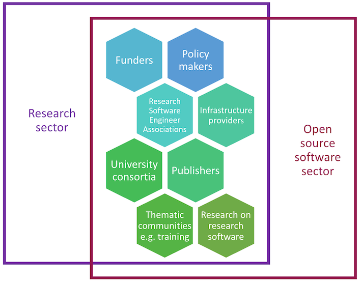

---
title:
date: 2025-04-23
type: landing

sections:
  - block: markdown
    content:
      title: 
      text:   |
        Stakeholders
        {style="color: white; font-size: 2rem; text-align: center; "}
    design:
      background:
        image:
          filename: main-hero.png
          filters:
            brightness: 1
          parallax: false
          position: center
          size: cover
          text_color_light: false      
       
  - block: markdown
    content:
      title:
      text:   |
        ReSA engages multiple stakeholder groups across the international research software community to collaborate to achieve common goals. ReSA’s community encompasses many relevant research software organisations, initiatives, and communities that have a national or regional focus, disciplinary focus, or thematic focus (such as software citation or representation of RSEs).

        Our stakeholders include:

        * **Funders (e.g., government, industry):** Leadership of a [research software funders community](https://www.researchsoft.org/funders-forum/) that has engaged 60+ funding organisations in its goal to address common challenges and better coordinate investment globally, including development of the [Amsterdam Declaration on Funding Research Software Sustainability (ADORE.software)](https://adore.software/).  
        * **Policy makers (e.g., government, publishers, infrastructure providers, research organisations):** Engaging in the drafting of key international policy documents from [UNESCO](https://en.unesco.org/science-sustainable-future/open-science/recommendation) and [OECD](https://www.oecd.org/en/publications/oecd-principles-and-guidelines-for-access-to-research-data-from-public-funding_9789264034020-en-fr.html), which has led to the inclusion and recognition of research software as a crucial part of open science.   
        * **Research software engineering associations (e.g., regional, national):** Supporting the RSE community as secretariat for the [International Council of RSE Associations](https://researchsoftware.org/council.html); compiling a list of [resources on how to create an RSE group (within an organisation) or association (national, etc)](https://ogyaqy.clicks.mlsend.com/tj/cl/eyJ2Ijoie1wiYVwiOjc3ODEyOSxcImxcIjoxMzkxMzUzODY4NzUwNjk3OTUsXCJyXCI6MTM5MTM1Mzk4MDg0MzQ3MDk3fSIsInMiOiI3ZjUzNTJlYTM3ZTZiZjgyIn0); and contributing to [RSE research](https://www.researchsoft.org/blog/2024-09-23/).   
        * **Research software infrastructure providers (e.g,. for profit and not for profit):** Co-chairing the [Research Software Infrastructure Forum](https://www.researchsoft.org/rsi-forum/) to consider how to collectively address common challenges.  
        * **University consortia:** Facilitating [Policies in Research Organisations for Research Software (PRO4RS)](https://www.rd-alliance.org/groups/rda-resa-policies-research-organisations-research-software-pro4rs/members/all-members/), a joint ReSA and [Research Data Alliance (RDA)](https://www.rd-alliance.org/) working group to help build our collection of [institutional policies](https://www.researchsoft.org/software-policies/) and consider how to better share these with interested stakeholders.  
        * **Publishers (e.g., for profit and not for profit):** Supporting the ReSA task force on [code availability by publishers](https://www.researchsoft.org/taskforces/) to engage publishers in the coordination needed to gain wide-scale cultural change.   
        * **Thematic communities:** Co-leading the drafting of the [FAIR for Research Software Principles](https://www.nature.com/articles/s41597-022-01710-x) (FAIR4RS) which engaged 500+ community members; with outcomes documented in a [two-year adoption update](https://doi.org/10.5281/zenodo.10816032); and supporting ReSA [task forces](https://www.researchsoft.org/taskforces/) on [Actionable Guidelines for Making Research Software FAIR](https://drive.google.com/drive/u/0/folders/15srfB15eg9I5jKTSTMF_MlFZfGwX8qx8), and [FAIR4RS Review](https://drive.google.com/drive/u/0/folders/1YZn-oJ85eStIwBqymB6D2sOxrnG0Jm7A) that aims to understand where the principles have and have not been adopted, and why.
        * **Research on research software:** Co-authoring a [position paper](https://doi.org/10.5281/zenodo.13350747) on the criticality of research software in AI-driven research.  

        

            
        
    

    design:
      background:
        color: "#ffffff"
        text_color_light: false       

---