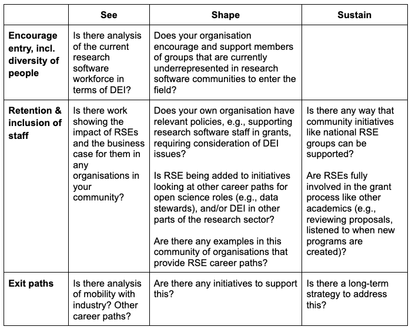

+++
fragment = "content"
weight = 100
categories = ["Blog"]

title = "Encouraging entry, retention, diversity and inclusion in research software careers"
#subtitle = ""
title_align = "left"

display_date = true
date = "2022-09-28"

[sidebar]
  title = "Important Links"
  align = "right"
  #sticky = true # Default is false
  content = """
  * [Sign up for the ReSA mailing list](https://landing.mailerlite.com/webforms/landing/i5e1h2)
  * [ReSA newsletters](/news)
  * [ReSA resources](/resa-resources)
  * [Contact us](/contact)
  """
  
+++

_September, 2022_  

Authors: Michelle Barker and Daniel S. Katz

## 1. Introduction

Commonly identified issues in the research software community include how to encourage people into research software career paths, how to retain them, and how to encourage a diverse range of people to enter the sector. This blog post attempts to help address them by considering existing projects and resources related to the research software profession in the following areas:

1. Encouraging entry, including by a diversity of people 
2. Retention and inclusion of staff
3. Exit paths

This blog post also provides some ideas from other fields before focusing on how stakeholders can assist in overcoming these major challenges.

## 2. Recognition of the importance of this issue

There are a range of international policies and initiatives that now focus on the importance of recognising the breadth of research community members who enable data-intensive research. The need for this recognition is equally prominent in the research software community with relation to the people who develop and maintain research software. The [ReSA People Roadmap Report](https://www.researchsoft.org/documents/people-roadmap.pdf) identified organisations whose strategies and initiatives specifically support the people landscape for research software; numerous examples are available at national, disciplines and technology levels, and include: 

* Germany’s [de-RSE](https://www.researchsoft.org/documents/people-roadmap.pdf) has as its vision to: establish research software as a first-class citizen in academia, establish and support careers for Research Software Engineers (RSEs) across institutions, support the education relevant for RSE to increase the quality of research software, and grow and facilitate the RSE community in Germany.
* Canada’s [Research Software Current State Assessment](https://alliancecan.ca/sites/default/files/2022-03/rs_current_state_report_1.pdf) identifies challenges including that “The lack of diversity in the research software community suggests we need a more effective approach to equity, diversity and inclusion in the research software context.”
* A US National Academies report on [Next Generation Earth Systems Science at the National Science Foundation](https://www.nationalacademies.org/news/2021/09/national-science-foundation-should-create-next-generation-earth-systems-science-initiative-new-report-says) (NSF) publicises the need for RSEs and integration of diversity, equity, inclusion, and justice in all aspects of next-generation Earth systems science.
* [US-RSE](https://us-rse.org/mission/): Its mission includes: “We will actively promote, encourage, and improve diversity throughout the broader US RSE Community consistent with our full diversity, equity, and inclusion mission statement. We will ensure we provide an inclusive environment with equitable treatment for all and we will prioritise a program of diversity, equity, and inclusion. activities for our organisation, led by a dedicated team of active community members.” 
* [Large-scale computing: the case for greater UK coordination](https://www.gov.uk/government/publications/large-scale-computing-the-case-for-greater-uk-coordination) highlights that “investment in computer hardware alone will not be sufficient … demands outweighs supply and the workforce lacks the diversity required to produce software that encompasses the needs of society.” 

## 3. Encouraging entry, retention, diversity and inclusion 

This section examines how to achieve this across three areas: encouraging entry, including by a diversity of people; retention and inclusion of staff; and exit paths

**3.1 Encouraging entry, including by a diversity of people**

This covers two areas: encouraging entry and ensuring diversity in this.

*3.1.1 Encouraging entry*

The community of RSEs itself recognises this issue. [What do we (not) know about RSE?](http://doi.org/10.5281/zenodo.6395908), a crowd-sourced exercise to create an inventory of research questions about RSE that it would be beneficial to answer, prioritised questions including:

* Why do people become RSEs? What makes these careers attractive? 
* What background do RSEs have? Where do they come from?
* How are RSEs recruited? How are they found?

Consideration of this area could include broadening awareness of the opportunity and education in prerequisites, considering customised entry paths for different types of experiences (e.g., undergraduates in computer science, graduate students in a discipline, industrial software engineers, etc).

There is little on encouraging pipelines specifically into research software careers because there is no real career track to highlight. Consequently, what there is tends to focus more on research staff who are interested in improving their RSE skills through training initiatives such as [the Carpentries](https://carpentries.org/), [Code Refinery](https://coderefinery.org/), [INnovative Training Enabled by a Research Software Engineering Community of Trainers (INTERSECT)](https://intersect-training.org/overview/), etc. 

_3.1.2 Ensuring diversity_

Some of the small pieces of study on diversity in the research software community include: 

* The US Department of Energy’s [Request for Information on Stewardship of Software for Scientific and High-Performance Computing](https://www.energy.gov/science/articles/department-energy-releases-request-information-software-stewardship) (HPC) summary of responses identified challenges in building a diverse workforce and maintaining an inclusive professional environment that emphasised need for improvements in both recruiting practices and pipeline challenges.
* [Understanding Equity, Diversity and Inclusion Challenges Within the Research Software Community](https://arxiv.org/abs/2104.01712), which analyses recent survey data to provide evidence for a lack of diversity in the RSE community, identifies interventions which could address challenges in the wider research software community and highlights areas where the community is becoming more diverse. 

There are also some projects and tools on how to address this, such as:

* [Gender Decoder](https://gender-decoder.katmatfield.com/), a tool that provides a quick way to check whether a job advertisement has subtle linguistic gender-coding.
* [GenderMag](https://gendermag.org/), a tool that enables software practitioners (e.g., developers, managers, UX professionals) to find gender-inclusivity "bugs" in their software, and then fix bugs.
* Resources on employment such as those on [Practical Intersectionality](https://www.practicaldiversity.org/accessible/2022-04_Practical_Intersectionality/) from [Practical Diversity and Inclusion](https://www.practicaldiversity.org/). 

However, there is broader work on entry into computer science that could be useful, or more left field ideas such as:

* The [British Computer Society landscape review](https://www.bcs.org/media/8665/landscape-review-computing-report.pdf) recommends examination of access and participation by learners across key demographics in computer science qualifications.
* [Open Research Funders Group](https://www.orfg.org/) is creating the rough framework of an [Open and Equitable Model Funding Program](https://www.orfg.org/news/2021/10/25/openness-amp-equity-an-oa-week-reflection), co-created from the ground up with traditionally underrepresented communities and based on principles of equity, social justice, and open research. 

**3.2 Retention and inclusion of staff**

This covers two areas: retention of staff and inclusive practices.

_3.2.1 Retention of staff_

The need for recognition, career paths, and inclusion is well recognised in the broader community through initiatives for change in research assessment practices such as the [San Francisco Declaration on Research Assessment](https://sfdora.org/) (DORA) and the European [Agreement on Reforming Research Assessment](https://research-and-innovation.ec.europa.eu/system/files/2022-07/rra-agreement-2022.pdf). Some work is more specifically focused on digital research careers; for example, [Professionalisation in Cyberinfrastructure](https://papers.ssrn.com/abstract=3138592) addresses whether the cyberinfrastructure community should professionalise as it continues to encourage participation in cyberinfrastructure-related occupations, provide a career path, and continue to gain academic legitimacy. The community-created list of questions resulting from [What do we (not) know about RSE?](http://doi.org/10.5281/zenodo.6395908) also prioritised questions relevant to retention, including:

* Do available career progression paths help keep people in the career?
* How can an RSE career track have branching (e.g., not just go from senior to manager type roles). How do we create enough structure to allow for professional and personal growth, and recognition of that work? 

This need is also recognised in the RSE community through initiatives such as:

* The international RSE movement, which now has an [International Council of RSE Associations](https://researchsoftware.org/council), has celebrated ten years of growth. [How many RSEs in the world?](https://slides.com/simonhettrick/how-many-rses/fullscreen) estimates that there are at least 330,000 RSEs internationally.
* In the [ReSA People Roadmap Report](https://www.researchsoft.org/documents/people-roadmap.pdf), career paths and recognition for research software personnel was the most commonly identified priority area (by 40% of the initiatives that were involved).
* [Senior level RSE career paths (with an s)](https://danielskatzblog.wordpress.com/2021/09/27/senior-rse-paths/) identifies a range of possible career paths as shown in the following figure:

* A [report](https://bssw.io/blog_posts/a-report-on-the-sc21-research-software-engineers-in-hpc-rse-hpc-2021-workshop) on RSE in HPC noted that the role of HPC RSEs is still missing good career paths in academia and that their expertise is often not acknowledged.
* In the UK, the [ExCALIBUR RSE Knowledge Integration Landscape Review](https://doi.org/10.5281/zenodo.4986061) highlights that investment in software means investment in people, and identifies where major training and skills gaps exist to address issues of long-term career development for RSEs in HPC.
* In the US, [Expanding Pathways for Career Research Scientists in Academia](https://progress.institute/expanding-pathways-for-career-research-scientists-in-academia/) highlights challenges faced by research career scientists in choosing career pathways (including as research software engineers), and calls for US national funders to launch immediately tractable efforts to begin making headway in addressing the problem.
* [FORCE11 Software Citation Implementation Working Group](https://force11.org/groups/software-citation-implementation-working-group/) works with relevant stakeholders (e.g., publishers, registry and repository owners) to support software citation, leading to improved career recognition for those who are cited. 

National level solutions are generally lacking, but there are career paths for professions including RSEs at institutions including the [National Centre for Supercomputing Applications](https://ieeexplore.ieee.org/document/8823733) (USA), [University of Manchester](https://ieeexplore.ieee.org/document/8823733) (UK), [University of Notre Dame](https://ieeexplore.ieee.org/document/8823733) (USA), and [University College London](https://twitter.com/jamespjh/status/1565262566598889472?s=20&t=s95C10XywgabAzk1In7rJw).

There are some good examples for other emerging digital research professions such as data stewards, where work is more mature on some of these topics. For example, the [European Open Science Cloud (EOSC) Association Task Force on data stewardship curricula and career paths](https://www.fairsfair.eu/sites/default/files/20210915_EOSC-A_TaskForcePresentation_Training%20the%20trainers.pdf) aims to define a minimal data stewardship curricula, and career paths for data stewards and associated roles. This builds on work including [Towards FAIR data steward as profession for the lifesciences, and Professionalising data stewardship in the Netherlands. Competences, training and education: Dutch roadmap towards national implementation of FAIR data stewardship](http://doi.org/10.5281/zenodo.3471708). Similarly, the Research Data Alliance (RDA) [Professionalising data stewardship Interest Group](https://www.rd-alliance.org/groups/professionalising-data-stewardship-ig) is tackling challenges related to business cases, job profiles, training, career tracks and certification.

*3.2.2 Inclusive practices*

Research on inclusive practices for research software staff is limited, with more resources coming from similar discussions in the open source community. These address the different aspects of diversity and inclusion in software engineering, as well as the tools, methods, and practices proposed to foster diversity and to build inclusive software teams, inclusive development environments, and inclusive software that supports a diverse user-base. ReSA’s [Report on Vive la Différence - Research Software Engineers](https://zenodo.org/record/6859709#.Yxbn0exBzok) identifies some of the social science approaches to developing diverse research software communities and teams from this broader perspective. 

Other useful resources with different foci include:

* NumFOCUS [DISCOVER Cookbook](https://discover-cookbook.numfocus.org/) (Diverse & Inclusive Spaces and Conferences: Overall Vision and Essential Resources) 
* The Carpentries [Toolkit of IDEAS](https://zenodo.org/record/7041935#.YyEewOxBy7M) (Inclusion, Diversity, Equity and Accessibility Strategies), an inclusive design toolkit for regional Carpentries communities. 

**3.3 Exit paths**

This covers both mobility in and out of industry, and mobility into other roles. The latter supports those staff who want to progress their career away from research software to be able to make it clear that their background is useful for other roles related to management, faculty and industry, etc. This topic again emerged in the [What do we (not) know about RSE?](http://doi.org/10.5281/zenodo.6395908), with prioritised questions including: Why do RSEs quit and what do they do after they are RSEs? 

There is almost no formal work on this with regard to RSE. Countries that have some initiatives to support this generally for researchers include [Canada](https://alliancecan.ca/sites/default/files/2022-03/rs_current_state_report_1.pdf), which has a focus on industry engagement to support research staff mobility, with a history of industry-institution collaborations. Informally, RSE groups in universities have mixed feelings about this, as having trained RSEs leave the group has negative direct consequences to the group, but it also has positive aspects in terms of fulfilling the goal of the university in training people and contributing to society. 

There is a range of research on mobility issues in general; an [analysis of digital workforce issues in Germany](https://rfii.de/download/digital-competencies-urgently-needed-october-2019/) observes that, “the scientific labour market is subject to conditions that differ from those for research and development in the digital economy or in industry. Some of these conditions are helpful to promote change and innovative responses to the digital transformation while others tend to hinder them.” Similarly, the UK [Academy of Medical Sciences](https://acmedsci.ac.uk/file-download/77652269) report on how to fully realise the benefits of artificial intelligence in health notes: “The lack of a clear career pathway and lower salaries in academia were cited as two of the main reasons for leaving academic research.”

## 4. How can these challenges be overcome?

This analysis has shown that there are some useful initiatives and research available, although they are sparse. How could we build on these foundations to accelerate progress in this area? One option could be a landscape analysis identifying initiatives and gaps in this area. This could be structured utilising the Australian Research Data Commons’s [framework](https://zenodo.org/record/6378082#.YqAvdBNBxQM) for recognition of research software and the people responsible for it, which identifies three levels at which coordinated action is needed: to see software (increase visibility), to shape software (increase fit-for purpose), and to sustain software (increase sustainability). The table below includes some possible questions that could be asked of a variety of organisations to guide identification of useful initiatives going forward.

## Acknowledgements

This work is supported by the Alfred P. Sloan Foundation, grant no G-2021-17001.

