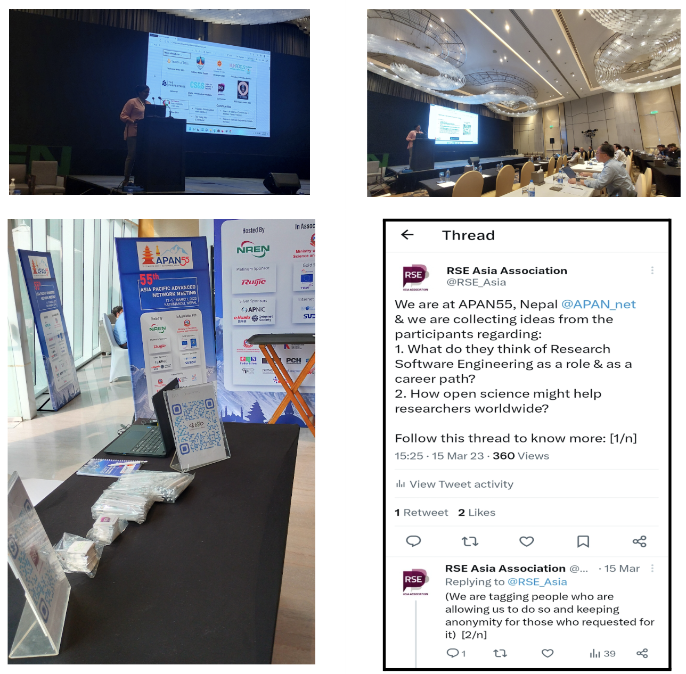

+++
fragment = "content"
weight = 100
categories = ["Blog"]

title = "Can National Research and Education Networks be a focal point for Research Software Engineers in some regions?"
#subtitle = ""
title_align = "left"

display_date = true
date = "2023-04-17"

[sidebar]
  title = "Important Links"
  align = "right"
  sticky = false # Default is false
  content = """
  * [Event website APAN55](https://apan55.apan.net/)
  * [Sign up for the ReSA mailing list](https://landing.mailerlite.com/webforms/landing/i5e1h2)
  * [ReSA newsletters](/news)
  * [ReSA resources](/resa-resources)
  * [Contact us](/contact)
  """

+++

April, 2023

Author: [Saranjeet Kaur Bhogal](https://saranjeetkaur.github.io/About-Me/)

## Introduction

This blog explores my thoughts on the potential role of [National Research and Education Networks (NRENs)](https://en.wikipedia.org/wiki/National_research_and_education_network) in promoting the growth of a Research Software Engineering (RSE) community in Asia-Pacific. The significance of this lies in the fact that NRENs have not traditionally been significantly involved in supporting RSE groups in other regions.

As I delved deeper into this topic, I learned that NRENs are specialised internet service providers designed to cater to the needs of research and education sectors in a particular region or country. These networks typically feature high-speed backbone connectivity and may provide dedicated channels for individual research initiatives. In the Asia-Pacific region, the [Asia Pacific Advanced Network (APAN)](https://apan.net) is the international partnership of the NRENs that provides both domestic and international high-speed network connectivity.

## RSE Asia at APAN

My interest in this topic grew during my participation in the [Society of RSE pilot mentoring programme](https://society-rse.org/events/pilot-mentoring-programme/), where my mentor, [Michelle Barker](https://www.linkedin.com/in/michelledbarker/), introduced me to APAN. As a result, I attended the [53rd APAN meeting (APAN53)](https://apan53.apan.net), which was held virtually from March 7th to 11th, 2022.

At APAN53, I contributed to a panel discussion entitled "Accelerating the paradigm shift towards Open Science and Data Sharing in pandemic times and beyond" and presented the [advancements of the RSE Asia Association](https://zenodo.org/record/7698570#.ZDV0Hi8Rp-U). Additionally, I shared the [narratives from RSE Asia Association](https://zenodo.org/record/7698591#.ZDV0Uy8Rp-U) at the workshop session titled "Growing research software initiatives and communities in the Asia Pacific."

However, it was at the [55th Asia Pacific Advanced Network (APAN55)](https://apan55.apan.net/) meeting in Kathmandu, Nepal, where I had the opportunity to attend as a [APAN55 Fellow](http://apan.net/fellowship/), that I gained more knowledge about the [NRENs in Asia](#national-research-and-education-networks-in-asia). The [Nepal NREN](https://www.nren.net.np) played an essential role in organising and hosting the event this year, and similarly, the [Lanka Education and Research Network (LEARN)](https://www.ac.lk), the Sri Lankan NREN, will be hosting and organising the upcoming APAN56 meeting.

### National Research and Education Networks in Asia

| Country/Region | National Research and Education Network |
| -------------- | -------------- |
| Afghanistan | Afghanistan NREN (AfgREN) |
| Bangladesh | [Bangladesh NREN (BdREN)](https://www.bdren.net.bd) |
| China | [China Science and Technology Network (CSTNET)](https://www.cstcloud.net/cstnet.htm) |
| China | [China Education and Research Network (CERNET)](https://www.edu.cn/english/) |
| Hong Kong | [Hong Kong Academic and Research Network (HARNET)](https://www.jucc.edu.hk/harnet/) |
| India | [Education and Research Network of India (ERNET)](https://ernet.in) |
| India | [National Knowledge Network (NKN) India](https://nkn.gov.in/en/) |
| Indonesia | [Indonesia Research and Education Network (IdREN)](https://idren.id) |
| Japan | [Science Information Network (SINET) Japan](https://www.sinet.ad.jp/en/aboutsinet-en) |
| Korea | [Korea Advanced Research Network (KOREN)](https://www.koren.kr/eng/index.asp) |
| Korea | [Korea Research Environment Open Network (KREONET)](https://www.kreonet.net/eng/) |
| Malaysia | [Malaysian Research and Education Network (MyREN)](https://www.myren.net.my) |
| Nepal | [Nepal Research and Education Network (NREN)](https://www.nren.net.np) |
| Pakistan | [Pakistan Education and Research Network (PERN)](https://pern.edu.pk) |
| Philippines | [Philippine Research , Education and Government Information Network (PREGINET)](https://asti.dost.gov.ph/projects/preginet/) |
| Singapore | [Singapore Advanced Research and Education Network (SingAREN)](https://www.singaren.net.sg) |
| Sri Lanka | [Lanka Education and Research Network (LEARN)](https://www.ac.lk) |
| Taiwan | [Taiwan Advanced Research and Education Network (TWAREN)](https://www.twaren.net/english/) |
| Thailand | [Thailand Education and Research Network (UniNet)](https://www.uni.net.th) |
| Vietnam | [Vietnam Research and Education Network (VinaREN)](https://www.vista.gov.vn/vinaren.html) |

At APAN55, I presented the ["RSE Asia Association: Journey and Future Plans"](https://zenodo.org/record/7817687) at the “Open and Sharing Data Working Group (OSDWG): Asia Pacific Open-Sharing Data and NRENs Open Science” session. Additionally, to promote the RSE Asia Association, I shared swag (sponsored by the [Open Life Science](https://openlifesci.org) programme). During the session, I also organised an activity in which participants were asked to share their ideas on Research Software Engineering (RSEng) as a career path and how open science could benefit researchers globally. I noticed several parallels between the duties and expertise of the staff at NRENs who develop research software infrastructure and those of RSEs while interacting with the attendees.
 
 
In a [Twitter thread](https://twitter.com/RSE_Asia/status/1635942735948414978?s=20), I compiled responses from APAN55 participants regarding their opinions on RSEng as a profession and a career path. One person from Malaysia responded, "I think it's an interesting path to choose especially for people who like to do research and also want to develop software". An attendee from Nepal commented, "For me it's a domain of software engineering”, while someone from South Korea observed that software has a significant impact in various domains. They stated that with software being integrated into almost every domain, there is a need for research to enhance its capabilities. Another participant from Nepal mentioned that they believed the role of RSEng to be important and its significance had grown over time. They further stated that the particular requirements of researchers could only be met by specialised software engineers who develop an understanding of the research ecosystem, have knowledge of existing solutions, and are capable of bridging any gaps that may exist. Quoting an attendee from India, "Indeed there could be a wonderful career for a software engineer in academia. If they get a rich experience over technology it can help the researchers to facilitate their theory into a workable project or product. Software Engineering could be a backbone where concepts can be transformed into productive algorithms and results can be automated. It can also set up a process path for executing a project. Problem statements can be set up by a software engineer for a group of students and academics."
 

_(From left to right and top to bottom) My presentation about the RSE Asia Association, RSE Asia Association swags, Twitter thread about the activity._ **Image credit:** [Saranjeet Kaur Bhogal](mailto:kaur.saranjeet3@gmail.com)

## Call to Action

In general, I have observed that RSEng is gaining recognition in broader conversations about Open Science, Open Source, etc. However, there seems to be a lack of direct attention towards this topic in the Asian region, as mentioned in a report on "[Expanding the mapping of the global research software community](https://www.researchsoft.org/blog/2022-10/)." To address this gap, I have been promoting awareness and leading the efforts to focus on RSEng within the APAN network (at APAN53 and APAN55). Given the breadth of the APAN network and NRENs in Asia, they could serve as a great hub for the research software community in the region. If you have any suggestions on how we can leverage NRENs to foster the growth of the RSEng community in Asia, please feel free to [contact me](kaur.saranjeet3@gmail.com). We might be able to submit a panel discussion on this topic at APAN56! Also feel free to share any ideas for other relevant conferences in the Asia-Pacific region.

**Acknowledgements:**
_This blog post has benefitted from the suggestions and feedback by [Michelle Barker](https://www.linkedin.com/in/michelledbarker/) and [Paula Andrea Martinez](https://www.linkedin.com/in/pambio/)._
