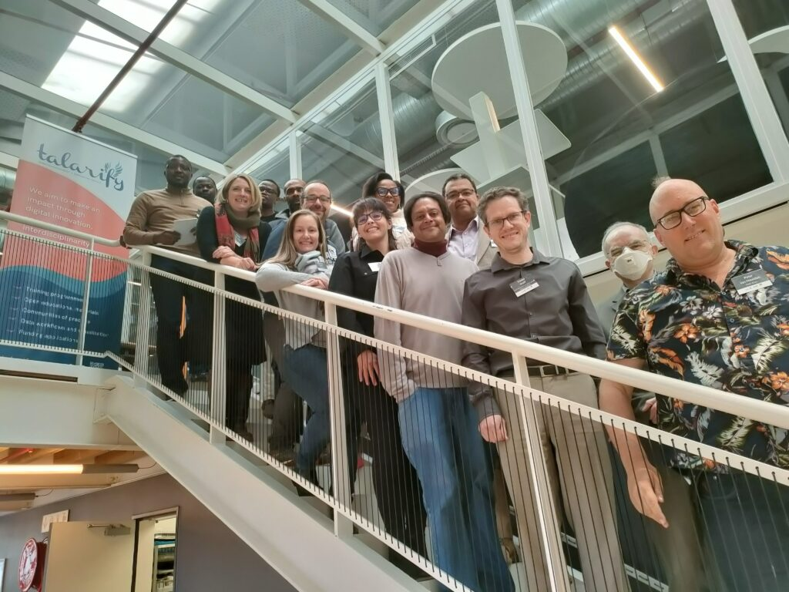

+++
fragment = "content"
weight = 100
categories = ["Blog"]

title = "Navigating the Unseen: Unveiling the Scope of African Research Software and Systems Engineering "
#subtitle = ""
title_align = "left"

disabled = false
display_date = true
date = "2023-12-06"
author = ["Anelda Van der Walt"]

[sidebar]
  title = "Important Links"
  align = "right"
  sticky = false # Default is false
  content = """
  * [ReSA newsletter](https://www.researchsoft.org/news/)
  * [RSSE Africa](https://rsse.africa/)
  * [RSSE Africa LinkedIn group](https://www.linkedin.com/groups/12903402/)
  * [Sign up for the ReSA mailing list](https://landing.mailerlite.com/webforms/landing/i5e1h2)
  * [ReSA resources](/resa-resources)
  * [Contact us](/contact)
  """

+++

Participants of the first Research Software Indaba held in Cape Town, South Africa in May 2023. _(Photo credit: Noxolo Chalale)_

By Anelda Van der Walt (Director, Talarify)

6 December 2023

The African continent is home to some of the world's most significant multi-country research projects. These projects often include research software and infrastructure development components, but it can be challenging to grasp the African research software and systems engineering (RSSE) landscape. This blog post shares information on ReSA’s activities to support RSSE in this region. It highlights the importance of having both a local community of practice where RSSEs can share their experiences and challenges, lessons learned, and solutions implemented *and* a global dialogue that includes African RSSEs as the RSSE movement matures, develops policies, and solidifies best practices. It concludes with a list of remarkable research projects and organisations that include RSSE components to illustrate how extensive and significant the African RSSE community is.

In 2023, [Talarify](https://www.talarify.co.za/) was appointed as the African Community Engagement Partner for the [Research Software Alliance](https://www.researchsoft.org/) (ReSA), with funding from a [grant](https://doi.org/10.5281/zenodo.7275397) through the [Chan Zuckerberg Initiative](https://chanzuckerberg.com/). As the  ReSA African Community Engagement Partner, we highlight information from the African community to enhance the visibility of local RSSE-related initiatives. We also share news, opportunities and resources from the ReSA community with African RSSEs and organisations involved in research software development through the channels listed below. We have spoken about the international Research Software Engineers (RSE) movement and ReSA’s work at various African forums, such as the inaugural [ZA-REN Week](https://events.tenet.ac.za/event/33/) (view the [presentation](https://zenodo.org/doi/10.5281/zenodo.10013667)). We have also engaged with the global community to share African RSSE news through events such as the Annual Conference for Research Software Engineering (RSECon 2023) (view the [presentation](https://doi.org/10.5281/zenodo.10013746)).

Our most significant contribution in the past six months was the first [African Research Software Indaba](https://rse-indaba.org) held in Cape Town, South Africa, in May 2023. The event covered discussions around four themes: 

- **Local RSSE initiatives** with presentations from [RSE@SUN](https://rse-at-sun.github.io/RSE-at-SUN/), [RSSE Africa](https://rsse.africa), and the [eLwazi Open Data Science Platform](https://elwazi.org/)
- **RSE movement, policy and funding** with presentations from Professor Simon Hettrick, Deputy Director of the UK [Software Sustainability Institute](https://software.ac.uk) (SSI), and Dr Michelle Barker, Director of ReSA
- **Existing capacity and training** with a presentation from Dr Angelique Trusler, African Capacity Development Manager at [The Carpentries](https://carpentries.org) and discussion led by Friedel Wolff, technical manager at the [South African Centre for Digital Language Resources](https://sadilar.org) (SADiLaR)
- **The next steps,** during which we identified some short- and medium-term activities, such as writing a paper to describe the local RSSE landscape and a follow-up meeting.

The 20 Indaba participants were primarily based in South Africa, but several are involved in projects that include other countries on the continent. They represented areas including bioinformatics, astrophysics, humanities and social sciences, high-performance computing, eResearch, IT, scientific computing, and open science. Read more about insights from the event in the [blog post](https://www.talarify.co.za/2023/05/29/driving-sustainable-research-software-and-systems-insights-from-the-first-research-software-indaba-in-africa/) and [report](https://doi.org/10.5281/zenodo.7980634).

The Indaba enabled discussions on global as well as locally relevant topics. Participants could relate well to issues highlighted by international speakers whilst also articulating unique challenges and shared experiences related to local contexts. Challenges identified in the UK, Europe, the USA and elsewhere related to career prospects, recognition, limited training opportunities, isolation, and lack of communities of practice where lessons learned can be shared are also evident for RSSEs on the African continent.

One example of a local context that impacts the RSSE environment is load shedding. Load shedding happens when an electric utility cuts power to some customers due to a shortage of available electricity. This has been a common phenomenon across many African countries for years, but in 2023, load shedding reached a new high (or rather low!) in South Africa, increasing to [316/328 days](https://loadshed.theoutlier.co.za/) (at the time of writing) with shedding between two to twelve hours a day. Although the cost and accessibility of stable internet connections on research have been discussed for many years, the impact of interrupted power supply on data and computing centres has largely been hidden. Participants unanimously voiced their frustrations and concurred that the conversation to find workable solutions needed to be continued.

One regional initiative that plays a role in providing a local community of practice is RSSE Africa. The contract with ReSA enabled Talarify to allocate resources to continue supporting [RSSE Africa](https://rsse.africa), which was established in 2019 by Peter van Heusden and Eugene de Beste from the [South African National Bioinformatics Institute](https://www.sanbi.ac.za/) (SANBI). To support RSSE Africa, we have:

- redesigned (and continue to maintain) the [website](https://rsse.africa)
- created an [RSSE Africa LinkedIn group](https://www.linkedin.com/groups/12903402/)
- created an [RSSE Africa X (Twitter)](https://twitter.com/RsseAfrica) account
- organised community meetups
- launched a [newsletter](https://rsse.africa/newsletters/) and 
- started a project to [spotlight African RSSEs](https://rsse.africa/project/spotlight/).

Talarify is looking forward to continuing working closely with ReSA, RSSE Africa, and various other global and local partners to amplify the voice of African RSSEs and create local awareness of existing resources, opportunities, communities, and more!

## African Research Projects and Organisations with RSSE components

This list highlights some initiatives with significant RSSE components to help craft a better understanding of the tremendous role of RSSEs in Africa. This is by no means an exhaustive list. It excludes numerous outstanding and hugely impactful research initiatives across many countries (most notably those in Francophone, Arabophone, and Lusophone regions) and a wide variety of disciplines.

**Astronomy, Physics & Mathematics**

The [**African Institute for Mathematical Sciences**](https://centres.nexteinstein.org/) (AIMS) is a network of centres across Africa that promotes education and research in mathematical sciences, contributing to developing mathematical expertise on the continent.

The [**ICTP-East African Institute for Fundamental Research**](https://eaifr.org/) (EAIFR) is a partner institute of the Abdus Salam International Centre for Theoretical Physics (ICTP) and a Category 2 UNESCO institute. The institute focuses on training physics graduates and research in topics related to condensed matter physics, geophysics, particle physics, cosmology, and more.

The [**National Institute for Theoretical and Computational Sciences**](https://nithecs.ac.za/) (NiTheCS) consortium includes 25 South African universities and institutes. The consortium’s research focuses on diverse but interconnected research areas such as theoretical physics, mathematics, astronomy and astrophysics, statistics, data science, quantitative finance, bioinformatics and quantitative biology, earth systems modelling, and climate change modelling. 

The [**Square Kilometre Array**](https://www.skao.int/) (SKA) is a global project with a significant African presence. The SKA-Mid, which will be constructed in South Africa, will have four times the resolution and five times the sensitivity and will be able to survey the sky 60 times faster than the Karl G. Jansky Very Large Array (VLA) telescope in the United States. The computing and data infrastructure required for the SKA project is “astronomical”.

**Biodiversity and Agriculture and Bioinformatics**

The [**African BioGenome Project**](https://africanbiogenome.org/) (AfricaBP) is a coordinated pan-African effort to build capacity (and infrastructure) to generate, analyse, and deploy genomics data for the improvement and sustainable use of biodiversity and agriculture across Africa. 

The [**International Livestock Research Institute**](https://www.ilri.org/) (ILRI) is a CGIAR research centre operating across Southern and Eastern Africa. ILRI’s mission is to “improve food and nutritional security and to reduce poverty in developing countries through research for efficient, safe and sustainable use of livestock.”

**Health and Bioinformatics**

The [**Africa Centre for Disease Control and Prevention (Africa CDC) – Africa Pathogen Genomics Initiative**](https://africacdc.org/institutes/ipg/) aims to “maximise the benefits of next-generation genomic sequencing tools by empowering public health experts in the continent with the tools, training and coordination needed for data-driven decision-making for preventing and responding to disease threats.”

The [**Data Science for Health Discovery and Innovation in Africa**](https://dsi-africa.org/) (DS-I Africa) Initiative “aims to leverage data science technologies to transform biomedical and behavioural research and develop solutions that would lead to improved health for individuals and populations.”

The [**Human Heredity and Health in Africa**](https://h3africa.org/) (H3Africa) consortium was funded between 2011 and 2021 by the US National Institutes of Health, Wellcome Trust, the African Academy of Sciences, and the Science for Africa Foundation. The consortium comprises 51 African projects from 30 different countries. Project topics include population-based genomic studies of common, non-communicable disorders such as heart and renal disease and infectious diseases such as tuberculosis.

[**H3ABioNet**](https://h3abionet.org/) is a sub-project of H3Africa and was established to develop bioinformatics capacity, specifically genomics data analysis expertise within the H3Africa projects. These projects included infrastructure development, bio-repositories and analysis pipelines, and intensive bioinformatics training. 

**Natural Language Processing, Machine Learning and Artificial Intelligence**

The [**Deep Learning Indaba**](https://deeplearningindaba.com/2023/) aims “to build a sustainable pan-African community of Artificial Intelligence (AI) expertise, create local leadership in AI in every country across the continent, and recognise excellence in research and application of AI technologies, respectively.” 

The [**Machine Intelligence Institute of Africa**](https://miiafrica.org/research/) (MIIA) is a non-profit organisation that spans academia, industry, government, and non-governmental organisations. MIIA aims to “transform and help build an AI-powered Africa through a strong, innovative and collaborative Machine Intelligence, AI and Data Science community, consisting of individuals and key players in the African Artificial Intelligence Ecosystem”.

[**Masakhane**](https://www.masakhane.io/) is a grassroots organisation whose mission is to “strengthen and spur NLP research in African languages, for Africans, by Africans.”

**Acknowledgements**

This project has been made possible in part by a grant from The Chan Zuckerberg Initiative DAF, an advised fund of Silicon Valley Community Foundation.

Group photo of volunteers at RSECon23, Swansea, UK
