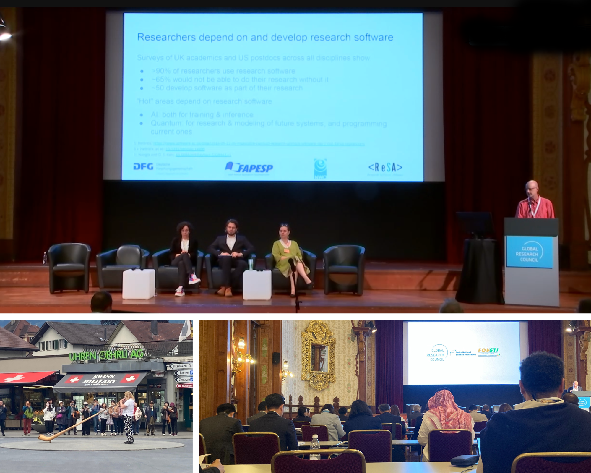

+++
fragment = "content"
weight = 100
categories = ["Blog"]

title = "Funder community focuses on crucial role of research software"
#subtitle = ""
title_align = "left"

disabled = false
display_date = true
date = "2024-06-20"
author = ["Kim Hartley, Michelle Barker, Daniel S. Katz"]

[sidebar]
  title = "Important Links"
  align = "right"
  sticky = false
  content = """
  * [DOI: https://zenodo.org/records/12191210](https://zenodo.org/records/12191210)
  * [ReSA newsletter](https://www.researchsoft.org/news/)
  * [Sign up for the ReSA mailing list](https://dashboard.mailerlite.com/forms/778129/110635094443558050/share)
  * [ReSA resources](https://www.researchsoft.org/resa-resources/)
  * [Contact us](https://www.researchsoft.org/contact/)
  """

+++

_Daniel S. Katz, Maria Cruz, Michelle Barker, and Florian Mannseicher at the Global Research Council annual meeting in Interlaken, Switzerland - May 2024_
_(Image credit: Daniel S. Katz)_

Authors: Kim Hartley, Michelle Barker, Daniel S. Katz

Given that software is an integral component of research processes and a widely used instrument for scientific research in all fields, funders have increasingly recognised and valued research software and the people who develop and maintain it as fundamental and vital to research globally. The Research Software Alliance (ReSA) has led the development of the funders community into the [Research Software Funders Forum](https://www.researchsoft.org/funders-forum/), which has engaged more than 60 funding organisations from across the globe since its inception in 2022. The Funders Forum has been working diligently to address common challenges to achieve the significant cultural change needed across the research sector and better coordinate investment globally. This group of funders has been instrumental in improving the research software ecosystem to accelerate research outcomes through its commitment to the sustainability of research software and the people who develop and maintain it. ReSA is pleased to highlight some of the Funders Forum’s accomplishments in this blog post, which follows the 2024 [Global Research Council (GRC)](https://globalresearchcouncil.org/) annual meeting in Interlaken, Switzerland. A key outcome of the Funders Forum’s work is the inclusion of a research software side event at the GRC meeting.

The importance of research software is becoming increasingly clear. Not only has research software expedited scientific progress, it is now a crucial tool for ensuring the reproducibility of research outcomes. Research shows, for example, that [~20% of National Science Foundation (NSF) projects (totalling USD$10b) over 11 years discussed software in their abstracts](https://zenodo.org/records/5748175); [software-intensive projects are a majority of current publications](https://ieeexplore.ieee.org/document/8109183); [33% of research results in new code](https://www.oecd-ilibrary.org/science-and-technology/charting-the-digital-transformation-of-science_1b06c47c-en); and [47% of 13,784 Australian Research Council (ARC) grants between 2010 and 2019 produced software](https://zenodo.org/records/10530616). Moreover, [Software and skills for research computing in the UK](https://doi.org/10.5281/zenodo.10473186) reports that “software has transformed every stage of the research lifecycle”. And the Chan Zuckerberg Initiative (CZI) [has released a dataset](https://medium.com/czi-technology/new-data-reveals-the-hidden-impact-of-open-source-in-science-11cc4a16fea2) entirely composed of 67 million software mentions mined from the scientific literature to understand how widely research software and open source tools are used across disciplines, and which software is used where.

## **Overview of the Funders Forum**

The Funders Forum provides a structured platform for research software funders to share practices and address common problems. It has successfully engaged a broad range of participants from government/government-funded, philanthropic, and industry organisations internationally. Regions represented include Africa, Asia, Australasia, Europe, Latin America, and North America. The Funders Forum began in 2022 with support from the [Alfred P. Sloan Foundation](https://sloan.org/), and thanks to the philanthropy’s ongoing support in 2023 and support from ReSA’s [Organisational and Founding Members](https://www.researchsoft.org/membership/), the Funders Forum has continued to grow and become an established community. In its second year, the number of funding organisations that had engaged with the Funders Forum doubled (from 30 to 60).

As a secretariat, ReSA convenes and manages the Funders Forum community. Funders Forum members engage in a variety of activities that help the community achieve its goals, from general regular meetings to focused working groups. ReSA aims to serve both funders new to research software and those who are well-versed in the ecosystem. The continuity of this collaboration is especially important, as the Funders Forum has played a fundamental role in bringing together a wide range of global stakeholders; supporting the advancement of research software; and increasing recognition of the importance of research software.

ReSA is grateful to all the funders who engage in this important work and support the sustainability of the Funders Forum through ReSA’s [Organisational Membership program](https://www.researchsoft.org/membership/), such as the US National Institutes of Health (NIH). As Dr. Susan Gregurick, Associate Director for Data Science and Director of the [Office of Data Science Strategy (ODSS)](https://datascience.nih.gov/) and Ishwar Chandramouliswaran, Lead, FAIR Data & Resources, ODSS, describe,

+++
fragment = "quote"
#disabled = false
date = "2024-06-20"
weight = 100
background = "primary"

quote = "placeholder quote."
author = "Saranjeet"
#author_title = "Title placeholder"
#author_link = "placeholder link"
#author_img = "placeholder image link"
+++

> NIH is pleased to support, through membership and relevant activities, the Research Software Alliance (ReSA). ReSA’s mission to bring research software communities together to collaborate and advance science aligns with the NIH’s mission to accelerate health discovery by supporting the development and sustainment of biomedical research software. As a funders forum participant, we have the opportunity to engage with other funders who share similar missions and learn about their programs including identifying opportunities for potential collaboration. And as an organizational member, NIH and our community benefit from various resources developed by ReSA such as the FAIR for Research Software principles and the catalog of [funding opportunities](https://www.researchsoft.org/funding-opportunities/) made available to the community. NIH is pleased to support this vibrant community and its leadership and we believe it is timely given the critical role of software and AI/ML applications in advancing health research.

Moreover, Dr. Maria Cruz, Programme Leader Open Research Software and Senior Open Science Policy Advisor at the [Dutch Research Council (NWO)](https://www.nwo.nl/en), shares that,

> As funders of research, NWO recognises the growing importance of software in the research process and is committed to improving research software sustainability and the overall research software ecosystem. This is evident through NWO’s launch of the [Open Science NL](https://www.openscience.nl/en) programme in March 2023, and substantial investments to sustain open research software and train researchers on open source software skills.
> 
> Our participation in the Funders Forum has played a crucial role in shaping our approach to open research software. Through the exchange of knowledge and best practices within the Forum, we have gained valuable insights into effective mechanisms for funding research software, which have informed and enhanced our funding strategies and initiatives. As we continue to participate in the Funders Forum, we look forward to further collaboration and knowledge sharing that will advance the adoption of open science principles and practices not only within the Netherlands but also on a global scale.

And Dr. Richard Gunn, Programme Director, Digital Research Infrastructure, at [UK Research and Innovation (UKRI)](https://www.ukri.org/) notes that,

> ReSA membership and participation in the Funders Forum is extremely valuable to UKRI. ReSA has convened a diverse yet focussed community of practice – from national public funders to private foundations and infrastructure providers – all of whom are united in a desire to develop a sustainable research software ecosystem. The Funders Forum enables us to contribute to developing the evidence base and good practice in the field through collaboration with global leaders and those working in different contexts.

## **Outcomes**

The Funders Forum has made significant progress in addressing shared issues and supporting the advancement of research software. Thanks to members’ recognition of the importance of research software and the people who develop it and maintain it, as well as their dedication to research software sustainability, the Funders Forum has contributed to the significant cultural change needed across the research sector globally. Below are some of the Funders Forum’s achievements, such as the inclusion of research software as a side event at the annual GRC meeting; drafting and release of the Amsterdam Declaration on Funding Research Software Sustainability and its complementary toolkit; convening of annual global gatherings of research software funders; development of partnerships with other funding consortiums; and sharing of outputs from Funders Forum discussions with research software communities.

### **Global Research Council 2024 Annual Meeting - side event on research software**

_Global Research Council annual meeting in Interlaken, Switzerland - May 2024_
_(Image credit: Michelle Barker)_

A key outcome of the Funders Forum is the inclusion of research software as a side event at the 2024 GRC annual meeting last month. The proposal was led by the [German Research Foundation (DFG)](https://www.dfg.de/en), NWO, and the [São Paulo Research Foundation (FAPESP)](https://fapesp.br/en).

This side event on _Research Software - Challenges and Funding_ discussed gaps related to research software in the current global funding and policy environment, and suggested concrete actions that research funding organisations can take to address them. There are also opportunities to nominate research software as a focus area in future regional and national meetings.

Dr. Florian Mannseicher, Programme Officer at DFG, reflects that,

> Despite its ubiquitous use for scientific research in all fields, research software is still often overlooked by many research funding agencies worldwide. The lack of proper funding for maintaining research software leads to waste of resources, duplication of effort, and difficulties in reproducibility as well as long-term availability of research software.
> 
> The side event at the GRC annual meeting in Interlaken aimed to discuss and evaluate, on a global scale, how the development, use, and evolution of research software can be advanced in a concerted manner via concrete actions by research funding organizations. For example, the side event addressed how funding organizations can help tackle key social challenges facing the research software community and thus contribute to a culture change toward open, digital science.
> 
> This initiative is another step in the ongoing collaboration between DFG, NWO, and ReSA regarding the topic research software. It originated as part of activities around the Funders Forum and was initiated by FAPESP. DFG and NWO have recently joined ReSA as organisational members and will thus continue to help contribute to ReSA's [vision](https://www.researchsoft.org/about-resa/) in the long term. Moreover, DFG has demonstrated its support of research software through significant investments in research software sustainability, quality, and reusability. DFG [recently announced a new funding programme](https://www.dfg.de/en/news/news-topics/announcements-proposals/2024/ifr-24-41) to facilitate the development of infrastructures for research software. The [Research Software Infrastructures program](https://www.dfg.de/en/research-funding/funding-opportunities/programmes/infrastructure/lis/funding-opportunities/research-software-infrastructures) aims to pave the way for the improvement of subject-specific handling of research software while supporting the development of a community-based framework of research software infrastructures in Germany.

The Funders Forum Working Group (WG) on a multilateral funding call for research software has played a pivotal role in forming connections with the GRC and supporting international collaboration. The WG also developed a draft call, based on [results from a survey](https://zenodo.org/records/10651247) completed by 280 scientists worldwide about their interest in an international funding call on research software development. The WG is now exploring options (e.g., joining an existing multilateral agreement) and considering next steps, and is looking forward to expressions of interest that may arise from other funders after this GRC side meeting.

### **ADORE.software and Toolkit**

The [Amsterdam Declaration on Funding Research Software Sustainability](https://adore.software/declaration/) (ADORE.software) and its complementary [toolkit](https://adore.software/toolkit/) represent a significant achievement that builds on actions undertaken by the Funders Forum, ReSA, research funding organisations, and the community to develop awareness about the role funders can play in sustaining software in the longer term. [ADORE.software](https://adore.software/) is a first step to formalise, on a global level, the basic principles and recommendations related to funding the sustainability of research software, including the people needed to achieve this goal. The Declaration is an outcome of the first [International Funders Workshop: The Future of Research Software](https://future-of-research-software.org/). Funders Forum members have engaged in the drafting and adoption of the Declaration, providing important inputs throughout the process. [Version 1.0 of ADORE.software](https://adore.software/declaration/) was released in September 2023, prior to the [second funders workshop](https://adore.software/international-research-software-funders-workshop/) in Montreal and online. Since the Declaration’s [release for signing](https://www.researchsoft.org/blog/2023-09-15/), several funding organisations have become [signatories](https://adore.software/signatories/) and a number of non-funders and individuals have expressed their [support](https://adore.software/get-involved/).

### **International Research Software Funders Workshops**

The International Research Software Funders Workshops, which have occurred annually since 2022, are evidence of funders’ commitment to supporting research software sustainability and international collaboration. Funders Forum members have been actively involved in co-hosting the workshops with ReSA, planning the agendas, giving talks, and facilitating breakout sessions for these events.

In November 2022, the [Netherlands eScience Center](https://www.esciencecenter.nl/) and ReSA organised the inaugural [International Funders Workshop: The Future of Research Software](https://www.future-of-research-software.org/). During the workshop, participants explored how to effectively fund new and existing research software. The resulting [blog post](https://www.researchsoft.org/blog/2022-11/) and [report](https://zenodo.org/records/7384410#.Y4k4VexBw3E) summarise the importance of what has now become an annual event. Prior to the workshop, the [Australian Research Data Commons (ARDC)](https://ardc.edu.au/) and ReSA co-hosted a workshop on [research software visibility](https://future-of-research-software.org/pre-workshop/). Slides from the pre-workshop event are available via ReSA’s [Zenodo community](https://zenodo.org/communities/resa/records?q=&l=list&p=1&s=10).

The [Digital Research Alliance of Canada](https://alliancecan.ca/en) and ReSA co-hosted the second [International Research Software Funders Workshop](https://adore.software/international-research-software-funders-workshop/) in September 2023. Experts explored how research software funders can facilitate capacity building through funder practices; research software platforms, infrastructure, and communities; and new initiatives. The outcomes of this workshop are highlighted in the resulting [blog post](https://www.researchsoft.org/blog/2023-10/) and [report](https://zenodo.org/records/10552116) collectively written by participants. Prior to this workshop, ReSA delivered a half-day session on [How to Explicitly Support Research Software as Part of Your Funding Program](https://docs.google.com/presentation/d/1UP_UGOPxYi0R4UAE5PRpGWoJzrQ2FkVmCdDBILR6t2U/edit#slide=id.g241153165a8_0_0) to introduce funders to research software, and to help them understand that they already fund research software. There was also a half-day session on [CiteSoftware](https://zenodo.org/records/8356278), led by a group of stakeholders aiming to drive the adoption of a common research software preservation and citation guidance resource for the research community.

The [SciLifeLab](https://www.scilifelab.se/) [Data Centre](https://www.scilifelab.se/data/) and ReSA are hosting the third funders workshop in Uppsala, Sweden, this September. The [workshop](https://adore.software/2024-international-research-software-funders-workshop/) will focus on operationalising the Declaration by developing a monitoring framework to benchmark how funders are currently supporting the sustainability of research software, using the recommendations as a starting point. Additionally, the workshop will examine how such a monitoring framework can be leveraged by funders and the community to prioritise critical areas for improvement.

### **Partnerships**

The Funders Forum has successfully built linkages with other funding consortiums and continues to develop relationships with other groups and stakeholders. For example, in March 2023, the Research Software Funders Forum and the [RDA Funders Forum](https://www.rd-alliance.org/funders-forum/) successfully co-convened a meeting prior to the RDA Plenary 20 in Gothenburg, Sweden, and online. As there is some overlap in members of the two funders forums and alignment of interests, ReSA and RDA have continued to develop this relationship. Moreover, representatives from the [Open Research Funders Group (ORFG)](https://www.orfg.org/) have attended Funders Forum meetings, and ReSA has also connected with the [Science Philanthropy Alliance](https://sciencephilanthropyalliance.org/#). The Funders Forum will continue to explore ways in which it can align with other funding consortiums to further the impact and reach of the broader community’s efforts.

## **What do research software funders discuss?**

The Funders Forum has explored a variety of pertinent topics through its regular meetings, which take place approximately every six weeks. Both ReSA and Funders Forum members (and occasionally guest speakers) lead discussion topics and share resource materials during these meetings. ReSA shares outputs from this work that are relevant to the broader research software community. The Funders Forum has explored a number of topics, such as:

- Overview of the research software funding landscape - see [report](https://zenodo.org/records/6102487)
- Overview of the research software people landscape
- Lorentz Center workshop: Vive la différence – Research Software Engineers - see [blog post](https://www.researchsoft.org/blog/2022-07/), cross-posted with Better Scientific Software (BSSw)
- FAIR for Research Software (FAIR4RS) - see [blog post](https://www.researchsoft.org/blog/2022-08/)
- How can funders encourage entry, retention, diversity and inclusion in research software careers? - see [report](https://doi.org/10.5281/zenodo.7117842)
- Funding and evaluating open source software for research
- How to collaborate informally
- Open Source Program Offices - see [blog post](https://www.researchsoft.org/blog/2023-06/)
- Sustainable software investment
- Bridging the gap between prototype and software infrastructure
- Joint funding initiatives
- Reviewing research software proposals
- Aligning funder incentives to support research software
- Leveraging current and future investments to support research software engineers (RSEs) to create changes for RSE in research organisations
- Measuring the impact of research software - see [Charting the Course: Policy and Planning for Sustainable Research Software](https://urssi.us/policy)
- EOSC-EVERSE: Paving the way towards a European Virtual Institute for Research Software Excellence - see [slides](https://zenodo.org/records/10526785)
- Positioning research software in relation to artificial intelligence (AI)

## **Conclusion**

Throughout the past few years, the Funders Forum has encouraged and enabled funders to reflect and advance through the sharing and learning of funding practices for research software and the people who develop and maintain it; consider how to address key challenges in the research software community; expand their networks and identify collaboration opportunities; and explore how to achieve long-term sustainability for research software, particularly within key global infrastructures.

The Funders Forum serves a broad range of newcomers and experienced research software funders through its regular meetings, WGs, international events, and support materials, and it continues to grow in membership. The diversity of experience and perspectives of both newcomers and returning participants has created a dynamic global community that is changing funders’ understanding of research software and their investments in it.

**Are you a funder who is interested in learning more about research software and how to explicitly support research software as part of your funding program?**

- Join the Funders Forum by [contacting ReSA](mailto:info@researchsoft.org) (or encourage your funders to join!)
- Become a ReSA [Organisational Member](https://www.researchsoft.org/membership/) to demonstrate your commitment to international collaboration and innovation for research; and connect with other decision makers and key influencers
- Show your support for ADORE.software by becoming a Declaration [signatory or supporter](https://adore.software/get-involved/)
- Check out our research software funding opportunities [database](https://www.researchsoft.org/funding-opportunities/) or [add to it](https://forms.gle/r4Jw4swUd1SXigZc9)
- [Join](https://www.researchsoft.org/taskforces/) or [support](https://www.researchsoft.org/tf-support/) a ReSA task force
- Subscribe to our monthly [newsletter](https://www.researchsoft.org/news/) and follow us on [LinkedIn](https://www.linkedin.com/company/research-software-alliance/), [Slack](https://researchsoft.slack.com/join/shared_invite/zt-1flmrglww-SoWjAK_5TJyqLU_~Jx697w#/shared-invite/email), and [Mastodon](https://fosstodon.org/@researchsoft)
  
We look forward to welcoming you!

**Acknowledgements**

This project has been made possible in part by grants from the Alfred P. Sloan Foundation: G-2022-19564 and G-2021-17001.

