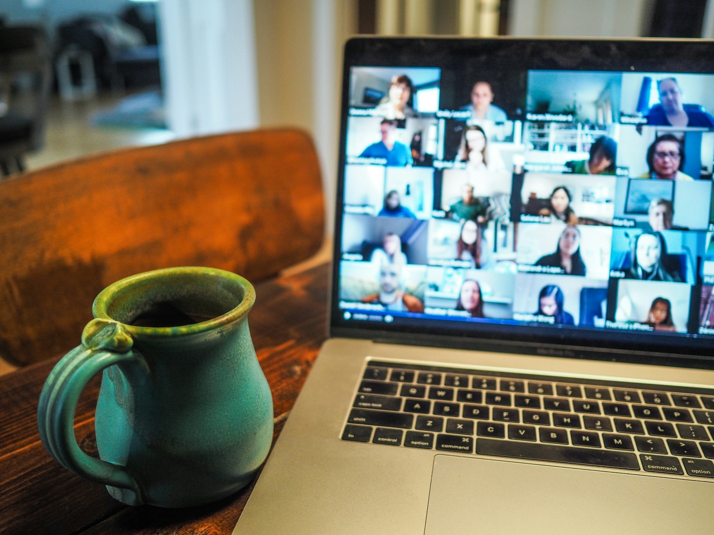

By Kim Hartley, Connie Clare, Federico Cetrangolo, Johan Espinoza Rojas, Michelle Barker

\[This blog past has been cross-posted by the [Research Data Alliance](https://www.rd-alliance.org/news/advancing-open-science-in-latin-america/) and LA Referencia\]

**Advancing Open Science in Latin America: Highlights from the ReSA, RDA, and LA Referencia webinar series on research software and research data**

Across Latin America and the Caribbean (LAC), momentum for open science is growing, driven by national policy initiatives and regional infrastructures that support the sharing and reuse of research outputs. However, progress remains uneven, shaped by varying levels of infrastructure, resource constraints, and gaps in awareness and training.

To help address these challenges, the [Research Software Alliance (ReSA](https://www.researchsoft.org/)), [Research Data Alliance (RDA)](https://www.rd-alliance.org/), and [Red Latinoamericana y de España de Ciencia Abierta (LA Referencia)](https://www.lareferencia.info/en/) convened a joint [webinar series](https://recursos.lareferencia.info/alianza-cienciaabierta/#programa) to support regional learning, strengthen collaboration, and elevate research software and data as essential research outputs.

Through free, public webinars, participants explored a wide range of topics — from why software and data matter, to practical research data management concepts and practices, research software sustainability across the research lifecycle, and emerging technologies shaping the future of open science. The series also expanded to interoperability through the Global Open Research Commons (GORC), and closed with a focus on the human and institutional dimensions of open science, including capacity building, skills development, recognition and research assessment, and community-led initiatives across the region. 

Across the six webinars held between June and November 2025, the series attracted 2,430 registrations and 1,184 attendees, reflecting strong regional interest in research software and data practices. Participants joined from across Latin America and the Caribbean, with particularly strong engagement from countries such as Peru, Brazil, Ecuador, Argentina, Colombia, Chile, Mexico, and Uruguay. Participation came from a diverse range of institutions, including universities, national science and innovation agencies, research institutes, and regional academic networks. To support participation across the region, webinars have been conducted primarily in Spanish, Portuguese, and English, with translation provided as needed.

**Webinar series highlights**

The webinar series launched in June 2025, bringing together experts and community leaders to explore both foundational and emerging topics related to research software, data, and open science. Across sessions, participants explored practical approaches to strengthening software and data practices, drawing on perspectives from researchers, policymakers, research software engineers, data stewardship and repository experts, library and information professionals, community leaders, and others. The series also helped deepen connections between regional initiatives and global open science communities, with a shared focus on sustainable, community-led capacity building. Below is a brief summary of each session.

***June 2025 – Why do data and software matter in research?***

The inaugural webinar introduced participants to the central roles of research data and research software in open science and modern scholarship. Moderated by Patricia Muñoz Palma, the session featured Lautaro Matas, Connie Clare, Daniel S. Katz, and Kim Hartley, who presented the work of LA Referencia, RDA, and ReSA, and set the stage for the series.

***July 2025 – Research data management: Key concepts and practices***

The July webinar focused on research data management (RDM) fundamentals, highlighting key frameworks and practices that support responsible data stewardship and reuse. Moderated by Juan Maldini, the session included presentations by Maui Hudson on the FAIR and CARE principles, Dawei Lin on enabling long-term data use through the TRUST principles, and Paula Bongiovani on RDM and data management plans (DMPs).

***August 2025 – The role of research software in the research lifecycle***

In August, the series emphasised research software as a core research output, and the importance of recognition, support, and sustainability across the research lifecycle. Moderated by Washington Segundo, the session featured Carlos Martinez-Ortiz on the role of research software in the research lifecycle, Yanina Bellini Saibene on [rOpenSci](https://ropensci.org/) and transforming science through open data, software, and reproducibility, and Riva Quiroga on learning and developing research software: between the local and the global.

***September 2025 – Emerging technologies and trends for research data and research software***

The September webinar explored emerging technologies and trends shaping the future of open science, offering a forward-looking view of how open science communities can adapt. Moderated by Vladimir Villarreal, the session highlighted work from RDA and ReSA groups, with presentations by Natalie Meyers ([RDA Artificial Intelligence and Data Visitation Working Group](https://www.rd-alliance.org/groups/artificial-intelligence-and-data-visitation-aidv-wg/activity/)), Pedro V. Hernández Serrano ([RDA & ReSA Policies in Research Organisations for Research Software (PRO4RS) Working Group](https://www.rd-alliance.org/groups/rda-resa-policies-research-organisations-research-software-pro4rs/activity/)), and Daniel Garijo Verdejo ([RDA FAIR for Machine Learning (FAIR4ML) Interest Group](https://www.rd-alliance.org/groups/fair-machine-learning-fair4ml-ig/activity/)).

***October 2025 – Global Open Research Commons: building an interoperable network in Latin America***

In October, the series focused on interoperability and collaboration at a global scale through the lens of the [Global Open Research Commons](https://www.rd-alliance.org/groups/global-open-research-commons-ig/activity/). Moderated by Hilary Hanahoe, the session featured Andrew Treloar, CJ Woodford, Javier Lopez Albacete, and Lautaro Matas, who discussed opportunities to strengthen regional infrastructure and enable interoperable, collaborative participation across global research ecosystems.

***November 2025 – Building capacity and fostering collaboration***

The November webinar centered on the human and institutional dimensions of open science, including capacity building, collaboration, and sustained community growth. Moderated by Isabel Recavarren Martinez, the session included presentations by Paula Martínez Lavanchy on training and skills development in data and software management, Roxana Cerda-Cosme on careers and recognition in data stewardship, Pastora Martínez Samper on research evaluation and assessment, Leyla Jael Garcia Castro on software management plans, Carlos Utrilla Guerrero on the potential role of generative AI in RSE training and research, and Jesica Formoso on community building through [MetaDocencia](https://metadocencia.org/).

***April 2026 – Closing webinar: Call for community pitches on research data and software***

To wrap up the series, the final webinar will take place on **30 April 2026 (14:00–15:30 UTC).** The session will feature a series of short community pitches, providing an opportunity for members of the research software and data communities to share practical experiences, tools, and initiatives, as well as concrete examples of work connected to topics explored throughout the series.

By opening the final session to contributions from the broader community, the webinar aims to showcase diverse perspectives from across regions and disciplines, while strengthening connections between ReSA, RDA, and LA Referencia communities. The session will also provide an opportunity to reflect on key insights from the series and consider future directions for capacity building, collaboration, and the continued development of open science ecosystems.

Details about registration, selected pitches, and speakers will be announced soon on the [webinar website](https://recursos.lareferencia.info/alianza-cienciaabierta/). 

**Strengthening open science through regional and global collaboration**

Building on a strong history of partnership among ReSA, RDA, and LA Referencia, this collaboration marks an important step towards advancing a more transparent, inclusive, and accessible research ecosystem in Latin America and the Caribbean.

Across the series, several cross-cutting themes emerged: research software and data must be treated as first-class research outputs; capacity building is most effective when it is regional, multilingual, and community-driven; incentives matter — recognition, evaluation, and policy are essential for sustainability; and interoperability and shared infrastructure enable collaboration across institutions and borders.

Together, these insights highlighted a recurring theme of the webinar series: advancing open science involves not only technical considerations, but also sustained community engagement. By bringing together global and regional perspectives in a practical, accessible format, the series supported stronger connections across the region. We are grateful to everyone who participated, presented, moderated, translated, and helped shape this initiative, and we look forward to continuing this work beyond the series.

Webinar recordings are available on the [webinar website](https://recursos.lareferencia.info/alianza-cienciaabierta/) in both Spanish and Portuguese.

**Acknowledgments**

*ReSA has been supported to undertake this work as part of Alfred P. Sloan Foundation grant 2024-22426, [Research Software Alliance: Catalyzing community-led collaborations](https://zenodo.org/records/10927376).*

*RDA has been supported to undertake this work as part of the 5th funding cycle of [SCOSS](https://www.rd-alliance.org/our-funders/scoss-funding/) (The Global Sustainability Coalition for Open Science Services).*

_Image credit:_ _Chris Montgomery, [Unsplash](https://unsplash.com/photos/macbook-pro-displaying-group-of-people-smgTvepind4)_

  <strong>
    This post is citable and FAIR thanks to 
    <a href="https://rogue-scholar.org/">Rogue Scholar</a>.
    <a href="https://rogue-scholar.org/communities/researchsoft/records?q=&l=list&p=1&s=10&sort=newest">
      Browse ReSA posts
    </a> on the Rogue Scholar.
  </strong>

