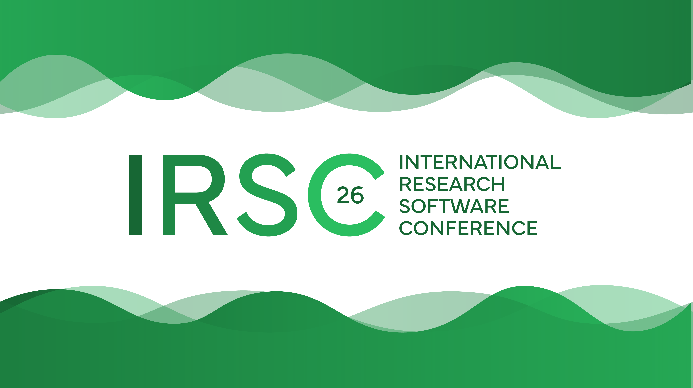

By [Kim Hartley](https://orcid.org/0000-0002-4345-9044), [Michelle Barker](https://orcid.org/0000-0002-3623-172X), [Selina Aragon](https://orcid.org/0000-0001-9938-0522), [Neil Chue Hong](https://orcid.org/0000-0002-8876-7606)

Building on a longstanding collaboration, ReSA is delighted to partner with the [Software Sustainability Institute (SSI)](https://www.software.ac.uk/) for the first [International Research Software Conference (IRSC)](https://www.researchsoft.org/irsc/).

Internationally recognised for shaping research software policy and practice, SSI has led training, community building, and advocacy activities since 2010\. As the first organisation dedicated to improving software in research, it has played a vital role in the UK and worldwide in advancing research culture, expanding access to training, and working with partners to develop policies that better recognise and support software as a fundamental component of research. Through its Fellowship Programme, community events, training, policy work, and collaborations with institutions, funders and international partners, SSI has helped establish research software as a fundamental component of modern research.

As a ReSA [Founding Member](https://www.researchsoft.org/about/) and long-time partner, SSI has also been central to ReSA’s development from the beginning, helping to shape its role as an international alliance for the research software community. ReSA Founding Members express their deep commitment to delivering the ReSA vision that research software and those who develop and maintain it are recognised and valued as fundamental and vital to research worldwide. To do this, Founding Members provide resources needed to support ReSA in its aim to bring research software communities together to collaborate on the advancement of the research software ecosystem.

The partnership builds on shared work to improve how research software is recognised, funded, and supported, such as the [Amsterdam Declaration on Funding Research Software Sustainability (ADORE.software)](https://adore.software/) and the [ADORE.software Toolkit](https://doi.org/10.5281/zenodo.15345286). SSI also plays an active role across ReSA’s activities, contributing to forums, [task forces](https://www.researchsoft.org/taskforces/), [resources](https://www.researchsoft.org/resource/resa-resources/), and events, including the recent workshop on [*Research Software Engineering in the Age of Generative AI: Building a Community Vision*](https://www.researchsoft.org/events/rse-ai-workshop/). 

Through its [Collaborations Workshop](https://www.software.ac.uk/collaborations-workshops) and [Research Software Camps](https://www.software.ac.uk/training/research-software-camps) series, SSI has built a strong track record of convening the research software community around emerging challenges and shared priorities. The SSI Collaborations Workshop is particularly recognised as a participatory, community-led event that brings together researchers, research software engineers, developers, funders, policy professionals, and infrastructure leaders to exchange practice, build collaborations, and generate practical outputs for the wider community. Alongside the more focused Research Software Camps, these activities demonstrate SSI’s ability to create inclusive spaces where ideas are tested and communities are strengthened. Together, ReSA and SSI bring complementary strengths to deliver the first International Research Software Conference: ReSA’s leadership in global research software community coordination and international collaboration, and SSI’s longstanding expertise in research software policy, practice, training, and community building. 

<blockquote>
  

  “IRSC is an important and timely opportunity to bring the international research software community together around a shared agenda: recognising research software as essential research infrastructure, supporting the people who develop and maintain it, and strengthening the policies and practices that enable it to thrive. SSI is delighted to partner with ReSA in helping to shape and deliver this inaugural conference.”
     - Neil Chue Hong, Director, Software Sustainability Institute
     

</blockquote>

This partnership reflects that shared commitment. Neil Chue Hong also serves on the [ReSA Steering Committee](https://www.researchsoft.org/about/governance/) and chairs its financial subcommittee, further strengthening ties between the organisations. In addition, [Kyro Hartzenberg](https://www.software.ac.uk/our-people/kyro-hartzenberg), SSI Event Manager, is providing in-kind support for IRSC26, contributing valuable expertise to the delivery of the conference.

ReSA is proud to partner with SSI in delivering IRSC and building a global platform that brings together the research software community.

Learn more about SSI at [www.software.ac.uk](http://www.software.ac.uk).

Sponsorship opportunities for IRSC are still available. Organisations interested in supporting the conference and engaging with the global research software community can learn more at: [https://www.researchsoft.org/irsc/sponsorship/](https://www.researchsoft.org/irsc/sponsorship/) or contact ReSA at [info\[at\]researchsoft.org](mailto:info@researchsoft.org).

  <strong>
    This post is citable and FAIR thanks to 
    <a href="https://rogue-scholar.org/">Rogue Scholar</a>.
    <a href="https://rogue-scholar.org/communities/researchsoft/records?q=&l=list&p=1&s=10&sort=newest">
      Browse ReSA posts
    </a> on the Rogue Scholar.
  </strong>

