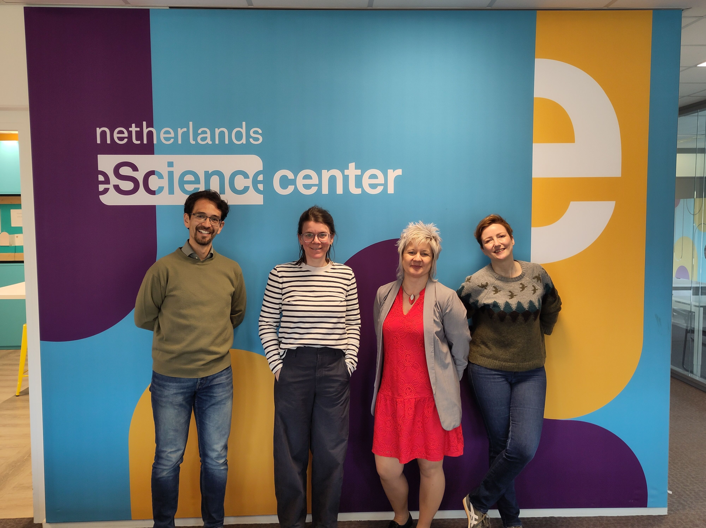

Authors: [Carlos Martinez-Ortiz](https://orcid.org/0000-0001-5565-7577), [Marta Teperek](https://orcid.org/0000-0001-8520-5598), [Lieke de Boer](https://orcid.org/0000-0003-3381-2040), [Burcu Beygu](https://orcid.org/0000-0001-8542-1506) 

[DOI: 10.59350/0q72d-wxr61](https://doi.org/10.59350/0q72d-wxr61)

_13 April 2026 · Netherlands eScience Center, Amsterdam (Photo by Netherlands eScience Center, CCBY)_

A few years have passed since the [Amsterdam Declaration on Funding Research Software Sustainability (ADORE.software)](https://adore.software/) was first signed, and Dutch signatories gathered at the Netherlands eScience Center to take stock of what has been achieved — and what work remains ahead. Representatives from NWO, ZonMw, the University of Groningen's Centre for Information Technology (CIT-RUG), and the Netherlands eScience Center (NLeSC) came together to exchange updates and explore opportunities for future collaboration.

## ADORE.software: the global context

The declaration now counts around 60 signatories, including 14 organisations from across the globe. The momentum behind its aims is being reinforced at the international level: a recent [OECD workshop](https://www.oecd.org/en/events/2026/03/access-to-research-software-opportunities-and-challenges.html) on access to research software brought together policy makers to identify considerations for supporting research software within the broader open science agenda. The workshop covered governance, infrastructure, human resources, standards and assessment, public-private partnerships, and international cooperation. The OECD is working towards a report and possible recommendations for member states. Raising awareness at Science Europe was flagged as a valuable next step.

The [ADORE.software Toolkit](https://docs.google.com/document/d/16T1rbMvKVWVa-eGXAc6POdS_WXWxZUYD395w3R008lM/edit?tab=t.0) includes practical recommendations and examples of good practices in funding sustainable research software. It continues to be updated and is widely shared with funders and the research software community.

Below is an overview of what each organisation is doing to implement the ADORE recommendations.

## Netherlands eScience Center

The eScience Center has made substantial progress in implementing the ADORE recommendations across all four thematic areas (which follow in bold).

On **research software practice**, the center promotes good practices through its training programme, [FAIR software recommendations](https://www.fair-software.eu/), and [national software management guidelines](https://www.esciencecenter.nl/national-guidelines-for-software-management-plans/).

Its research software sustainability and fellowship programmes address the **ecosystem** dimension, while active participation in ReSA's [Research Software Funders Forum](https://www.researchsoft.org/funders-forum/) supports international coordination.

On **personnel**, the center hires and funds RSEs by design, and has contributed to standardised [job profiles for research software engineers](https://lcrdm.nl/standardized-job-profiles-for-research-software-engineers/). It is also an endorser of CoARA, linking reward and recognition commitments to its core mission.

For **research software ethics**, the [Research Software Directory](https://research-software-directory.org/) provides a broad set of impact indicators, and the EVERSE project is developing open-source tools to [transparently calculate software metrics](https://everse.software/indicators/website/indicators.html). The center also advocates for software citation through guidance and tools such as the [CFF initialiser](https://citation-file-format.github.io/cff-initializer-javascript/#/).

## NWO

NWO has been active on both the policy and funding fronts. It conducted a study on [how well NWO- and ZonMw-funded projects share data and software](https://www.nwo.nl/en/news/sharing-research-data-and-software-how-are-nwo-and-zonmw-funded-projects-doing), and is now exploring ways to make such monitoring more sustainable. Improvements to how research software is reported in the grants system are also underway.

NWO is also currently [revising its Research Data Management policy](https://www.openscience.nl/en/cases/nwo-research-data-management-policy-revision-started) and is hoping to turn it into a broader Open Science policy. The plans are to include dedicated attention to research software: software sharing, citation, and the option for researchers to submit software management plans in place of data management plans where appropriate.

Through Open Science NL, NWO has provided dedicated funding for research software via two streams: a [call to strengthen local and thematic digital competence centres](https://www.openscience.nl/en/news/funding-awarded-to-strengthen-digital-competence-centers) (DCCs), which funded software trainer posts and a community manager role at NLeSC; and a [research software sustainability programme](https://www.openscience.nl/en/news/open-science-nl-and-the-netherlands-escience-center-join-forces-to-boost-research-software-sustainability) awarded to NLeSC. Software management plans were also piloted as part of the Open Science Infrastructure project, with plans to repeat this in the next call.

## CIT-RUG

CIT-RUG signed ADORE in October 2023 with the goal of raising awareness of research software's importance. The shift in culture is tangible: researchers and research group leads are increasingly vocal about valuing software as a research output.

With support from an OSNL grant, the DCC has expanded its training offering, adding three extra trainers and launching a certification programme for its [Reproducible Software Development Learning Line](https://www.rug.nl/digital-competence-centre/training-and-events/?lang=en). PhD candidates find particular value in this, as the training credits count towards their doctoral requirements. All [training materials are openly available on GitLab](https://gitrepo.service.rug.nl/dcc/training).

A notable milestone: the DCC's research software steward has been awarded a permanent contract. [Code cafes](https://www.rug.nl/digital-competence-centre/calendar/2026/code-cafe-02-07-2026) run in collaboration with the UMCG DCC have grown in popularity, attracting researchers from social sciences and economics as well as technical disciplines.

Challenges remain: research software management sits under the data policy at faculty level rather than a dedicated university-wide software policy, and there is still no institution-wide software repository (such as a GitLab instance), largely due to a shortage of personnel to maintain it.

## ZonMw

ZonMw signed the declaration in 2024 and appointed dedicated staff for research software at the end of 2025\. The initial focus has been on mapping the internal landscape: understanding which software and data are produced by ZonMw-funded projects, and building the infrastructure to track this systematically. Currently, only 0.26% of projects explicitly link to a software repository, a figure that underscores how much ground there is to cover.

Planned steps include expanding the data management plan template into an output management plan that formally recognises software as a grant output, and developing guidance for grantees and programme managers on research software. A software flowchart to help navigate decisions is also in development.

Looking further ahead, ZonMw is exploring dedicated funding instruments for existing software and integrating software more prominently into future programme calls. Guidance on evaluating non-traditional research outputs (including software)  is being developed in collaboration with ZonMw's reward and recognition experts.

## Looking ahead

The meeting demonstrated that Dutch signatories are translating ADORE's principles into concrete actions: from policy revision and funding programmes to training, hiring, and tooling. Common themes emerged across organisations: the challenge of sustainable staffing, the need for clearer policy frameworks at the institutional level, and the importance of making research software visible and citable as a first-class research output.

We hope this summary inspires other ADORE signatories to convene their own regional or national meetings. Want to sign it with your own organisation? Contact [info@researchsoft.org](mailto:info@researchsoft.org). Join us at the [**BoF: Committing to Sustainable Research Software with ADORE**](https://docs.google.com/document/d/1Y2veNrNu32I4vOJlWBoTYZqtlppnpaFmYdn2HvGrtw4/edit?tab=t.0) session at the [International Research Software Conference (IRSC)](https://www.researchsoft.org/irsc/).

  <strong>
    This post is citable and FAIR thanks to 
    <a href="https://rogue-scholar.org/">Rogue Scholar</a>.
    <a href="https://rogue-scholar.org/communities/researchsoft/records?q=&l=list&p=1&s=10&sort=newest">
      Browse ReSA posts
    </a> on the Rogue Scholar.
  </strong>

