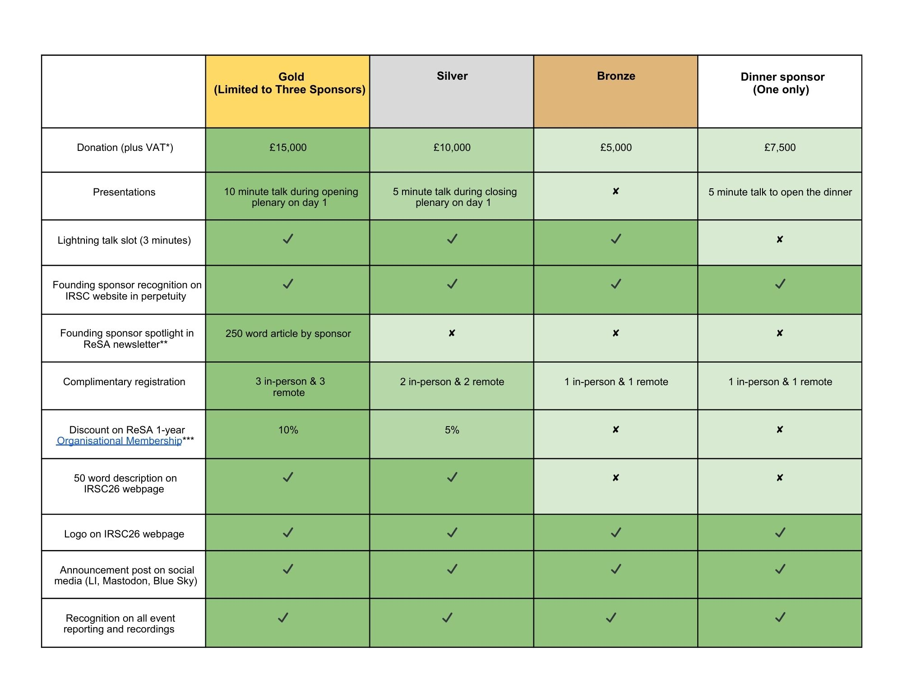

---
title:
date: 2026-02-09
type: landing

sections:
  - block: markdown
    content:
      title:
      text:   |
        IRSC26 Sponsorship
        {style="color: white; font-size: 2rem; text-align: center; "}
    design:
      background:
        image:
          filename: irsc-banner.png
          filters:
            brightness: 1
          parallax: false
          position: bottom
          size: cover
          text_color_light: false
      spacing:
        padding: ["4rem", "2rem"]

  - block: markdown
    content:
      title:
      text:   |

        

         

        <h2>IRSC26 Sponsorship</h2>

        # Event Overview

        **Event Name:** [International Research Software Conference (IRSC) 2026](https://www.researchsoft.org/irsc/) 

        **Date:** Monday 7 September \- Tuesday 8 September 2026 

        **Location:** Sheffield, UK

        **Expected Attendance:** \~200 attendees, including 125-150 in-person; 25-50 virtual 
  
        **Convenor**: [Research Software Alliance](https://www.researchsoft.org/) (ReSA)

        IRSC26 is co-located with [RSECon26](https://rsecon26.society-rse.org/) (9-11 September), which also offers separate [sponsorship opportunities](https://rsecon26.society-rse.org/sponsorship/sponsorship-overview). Sponsors may choose to support either event or both, depending on their goals and audience.  

        # About the International Research Software Conference (IRSC26)

        IRSC26 is a global gathering of **leaders and decision makers** working to advance global shifts and high-level collaboration across the research software community.

        The international research software community is moving towards aligning global policies and funding, sustaining essential infrastructure, recognizing and equipping its diverse workforce, responsibly integrating AI, improving how software impact is measured, and ensuring interoperability through open, standards-based infrastructure.
        
        This event aims to support the evolution of this shift. IRSC26 will catalyze this momentum by fostering:
        
        * **Global cohesion**: Highlight cross-border, cross-sector, and cross-discipline collaboration to build new bridges across the global research software landscape  
        * **Community connection**: Showcase stakeholder stories, collaboration highlights, and best practices to connect with peers and unite efforts  
        * **Strategic impact**: Influence funding, policy, and research priorities; and showcase leadership within the research software community and broader movements, including open science, FAIR, research assessment reform, and open source.
        
        # Why Sponsor IRSC26
        
        Sponsoring IRSC26 provides a valuable opportunity to engage with the global leaders and decision-makers working to shape the future of research software. Sponsors will gain meaningful exposure to an influential community that is aligning policy, funding, infrastructure, and practice across borders and sectors. By supporting IRSC26, your organisation will engage directly in high-level conversations that influence research software sustainability, standards, interoperability, and innovation, while demonstrating leadership within the global research software ecosystem. By sponsoring IRSC26, your organisation will:

        * Build relationships with leaders and innovators across a range of stakeholder groups (expected to be 125-150 attendees in-person, with 25-50 virtual attendees).  
        * Elevate your brand visibility through logo placement, speaking opportunities, and direct access to decision-makers shaping the future of research software.  
        * Further the international standing and influence of your organisation  
        * Strengthen community ties and visibility to enable strategic collaborations with key decision-makers and influencers in the field   
        * Form connections that can lead to policy influence.
        
        # Who You’ll Meet at IRSC26
        
        **IRSC26 attendees will include leaders and change-makers of organisations, initiatives, and communities committed to supporting research software, and those who develop it.** These include research organisations and research-supporting infrastructures; funders and policy makers, publishers, training and skills providers; national/international Research Software Engineers associations; university consortia, and related communities for open source software, open science and metascience. Many of these are already engaged in the various ReSA Forums.
        
        The event agenda encourages collaboration through a combination of talks, birds of a feather session, lightning talks, and plenary discussions. With an estimated attendance of around 125-150 people in person, you can expect sessions to be sized for maximum participation and engagement.  
        
        # Sponsorship Packages and Benefits
        
        Supporting IRSC provides valuable benefits including: a speaking opportunity at the event, prominent logo placements, complimentary tickets, and highlighting in social media. Below are suggested packages. There is also an option for interested partners wishing to focus their sponsorship by creating a bespoke package.
        
        We are also offering **Founding Sponsor status** to acknowledge sponsors at all tiers who help launch IRSC in its inaugural year, to celebrate their commitment to strengthening the global research community. 
        
        **All Founding Sponsors will receive permanent recognition on the IRSC website** under a “Founding Sponsors” section, regardless of future participation; and a unique place in the history of IRSC. 
        
        IRSC26 is only possible through generous contributions from our sponsors. Sponsoring this event offers a prime opportunity to connect with members of the influential and passionate community that enable research innovation. 
        
        
        
        \* UK VAT is charged at 20% in accordance with HMRC guidance. Non-UK businesses may be eligible to reclaim VAT via the UK [13th Directive refund scheme](https://www.gov.uk/guidance/vat-refunds-for-non-uk-businesses-13th-directive).

        \*\* ReSA’s newsletter reaches 600 individuals across the breadth of research software community stakeholders.
        
        # Bundle your sponsorship with ReSA Organisational Membership
        
        Join as a ReSA [Organisational Membership](https://www.researchsoft.org/about/membership/) at the same time and also receive a discount (for relevant packages only). Demonstrate your commitment to international collaboration and innovation for research (including [AI-driven research](https://doi.org/10.5281/zenodo.13350748)) by supporting ReSA’s work to bring the research software community together to collaborate on the advancement of the research software ecosystem. By joining us, you will join your peers in enabling outcomes that will achieve both your goals and those of the international community.
        
        # About the Research Software Alliance (ReSA), the host of IRSC26
        
        As host of IRSC26, the [Research Software Alliance](https://www.researchsoft.org/about/) (ReSA) convenes a global community of [stakeholder groups](https://www.researchsoft.org/about/stakeholders/) across the international research software community to collaborate to achieve common goals. ReSA’s community encompasses many relevant research software organisations, initiatives, and communities that have a national or regional focus, disciplinary focus, or thematic focus.
        
        
        
        The vision of ReSA is that research software and those who develop and maintain it are recognised and valued as fundamental and vital to research worldwide.ReSA aims to coordinate across these efforts to leverage investments, to achieve shared goals. The [ReSA Strategic Plan](https://doi.org/10.5281/zenodo.15444952) provides details. The [ReSA engagement plan](https://doi.org/10.5281/zenodo.7714004) contains more information on how community engagement occurs. 
        
        For all enquiries, including bespoke packages, please contact Michelle Barker, Research Software Alliance Director, [michelle@researchsoft.org](mailto:michelle@researchsoft.org). 

         

        

    design:
      background:
        color: "#ffffff"
        text_color_light: false
      spacing:
        padding: ["3rem", "1rem"]

---

