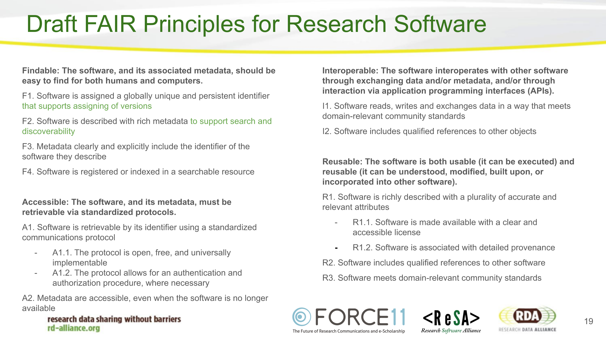

This month’s news includes:

* FAIR4RS Update
* Collaborations Workshop 21 videos
* Community news

### FAIR4RS Update

The [FAIR for Research Software (FAIR4RS) Working Group](https://www.rd-alliance.org/groups/fair-research-software-fair4rs-wg) presented the structure of the first draft of the FAIR4RS principles at the Research Data Alliance (RDA) [Plenary 17](https://www.rd-alliance.org/rdas-17th-plenary-meeting-programme) on 21 April 2021:

The Working Group initiated community consultation with the ~ 70 attendees focusing on key questions that arose during the writing sprints to create the first draft of the FAIR4RS principles. The intent of the FAIR principles for research software is to “ensure transparency, reproducibility, and reusability”, while acknowledging that foundational principles of Findable, Accessible, Interoperable, and Reusable may need to be reinterpreted to ensure that they are applicable to software. Drafting of the FAIR principles for research software includes consideration of two key challenges: 1) Finding the balance between general, more abstract, principles that capture the ethos of FAIR vs specific principles that point to the means of implementation. 2) Sticking closely to the FAIR data principles or reinterpreting the FAIR ethos for software.

The [slides](https://docs.google.com/presentation/d/1rX4iGsYhzDbrfHU6KkLZOGdY9y8BzRwRXxjiu8NgFJc/present#slide=id.g8885490676_0_74) and [collaborative notes](https://docs.google.com/document/d/12HkgeK35K5f9lfIk3-QLw1x8w7UL1KfrOp9CW9S97OY/edit%23heading%3Dh.pajmjy1b8nz1) are available for review and the recording will be publicly available at the end of May via the RDA YouTube channel. Instructions of how to engage in the next iteration of the draft principles will be sent via the FAIR4RS mailing list ([RDA FAIR4RS WG posts](https://www.rd-alliance.org/node/69317/posts)). Join the group to receive the notification.

### CW21 update

It’s a wrap for [Collaborations Workshop 2021](https://www.software.ac.uk/cw21) (CW21) hosted by the Software Sustainability Institute ran from 30 March to 1 April 2021. To catch up on the lively discussion on the themes of FAIR research software, diversity and inclusion and software sustainability, a range of materials are available:

-   Video of [keynotes](https://www.youtube.com/watch?v%3D8viA4y1pz_8)by Michelle Barker and Chonnettia Jones
-   Video of [panel session](https://www.youtube.com/watch?v%3D65a8c06VHOY) on diversity and inclusion
-   [Slides](https://ssi-cw.figshare.com/Collaborations_Workshop_2021_CW21_) from a number of workshops, including:
  -  [Interactive Introduction to the FAIR Research Software discussion](https://doi.org/10.6084/m9.figshare.14342498.v1)
  -  [How FAIR is your research software?](https://doi.org/10.6084/m9.figshare.14339546.v1)
  -  [Graphical User Interfaces for software](https://doi.org/10.6084/m9.figshare.14315966.v1)
  -  [Intermediate software development training in Python](https://doi.org/10.6084/m9.figshare.14318477.v1)
  -  [Group discussion summary: Implementing FAIR for research software: attitudes, advantages and challenges](https://doi.org/10.6084/m9.figshare.14453031)
  -  [Tips and Traps on the Road to FAIR software principles](https://doi.org/10.6084/m9.figshare.14494170.v1)

### Community news

- ReSA Steering Committee members Daniel S. Katz and Neil P. Chue Hong are editing a **special issue of PeerJ Computer Science on software citation, indexing and discoverability**. If you are doing any work in this area, please consider [submitting](https://peerj.com/special-issues/84-software).
- **CANARIE** is working to learn more about those who write research software, the needs of Canada’s research community, and how to better support research software developers. *If you’re a research software developer in Canada* then please complete the [survey](https://canarie.limequery.org/461928?lang%3Den).
- The **[US Research Software Engineer Association](https://us-rse.org/2021-04-14-virtual-workshop-announcement/)** (US-RSE) will hold a two-day Virtual Workshop on May 24 & 27, 2021. The theme of the workshop is “A Path forward for Research Software Engineers.” The (free) workshop will feature talks, community events, and working group sessions. The [Call for Proposals](https://us-rse.org/2021-04-14-virtual-workshop-announcement/%23call-for-proposals) closes on 3 May, and there is also a [Call for Reviewers](https://us-rse.org/2021-04-14-virtual-workshop-announcement/%23call-for-reviewers).
- **[FAIRsFAIR Week 2021](https://www.fairsfair.eu/events/fairsfair-week-2021)** included a public event on 13 April to showcase key stakeholder and community outputs and solutions for FAIR uptake. The [video](https://www.fairsfair.eu/events/fairsfair-2021-public-workshop) is now available.
- What are the implications of applying FAIR to a range of research products (beyond data)? Learn more in this blog on **[Generalizing FAIR](https://danielskatzblog.wordpress.com/2021/03/29/generalizing-fair)** by Daniel S. Katz and Michelle Barker.
- **[Github](https://docs.github.com/en/github)** now supports [sponsorship](https://docs.github.com/en/github/supporting-the-open-source-community-with-github-sponsors/sponsoring-open-source-contributors) of open source contributors. You can sponsor contributors, receive updates on developers and organizations you sponsor, and display a sponsor badge throughout GitHub.
- **SeptembRSE** - an online RSE Conference for 2021. The Society of Research Software Engineering will run a series of online sessions that will be spread throughout the month of September. Save the date!
- Software source code is a complex object, see Roberto Di Cosmo lightning talk [slides](https://annex.softwareheritage.org/public/talks/2021/2021-04-21-RDA-Data-Granularity.pdf) on software granularity at \#RDA [Plenary 17](https://www.rd-alliance.org/rdas-17th-plenary-meeting-programme)
- For information on Software Heritage see The Great Library of Source Code by Stefano Zacchiroli [slides](https://upsilon.cc/~zack/talks/2021/2021-03-20-libreplanet.pdf).

*If you’d like to suggest items for inclusion in ReSA News, please send them to [info@researchsoft.org](mailto:info@researchsoft.org). To receive ReSA newsletters, join the[ReSA google group](https://groups.google.com/forum/%23!forum/research-software-alliance) by sending a blank email to [research-software-alliance+subscribe@googlegroups.com](mailto:research-software-alliance+subscribe@googlegroups.com) and follow us on twitter [@researchsoft](https://twitter.com/researchsoft)*.

*The [Research Software Alliance (ReSA)](https://www.researchsoft.org) is a community of influencers and members of major research software communities, programs, organisations and individuals. ReSA’s vision is that research software be recognised and valued as a fundamental and vital component of research worldwide. The ReSA mission is to bring research software communities together to collaborate on the advancement of research software. ReSA is a fiscally sponsored project of [Code for Science and Society](https://codeforscience.org/)*.
